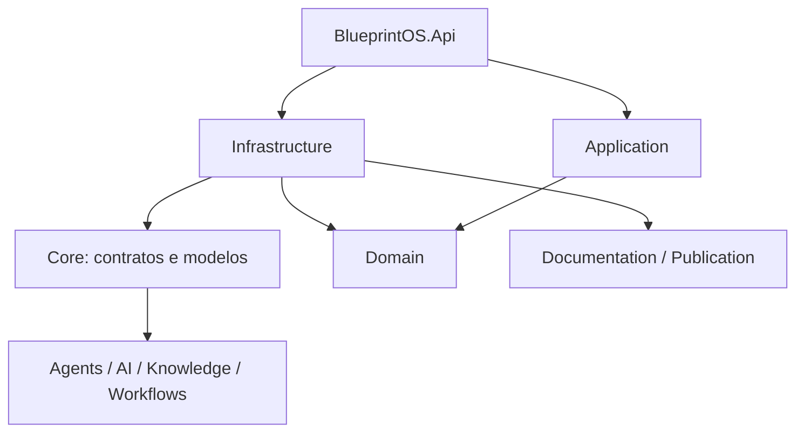
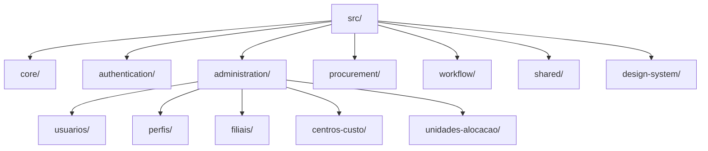
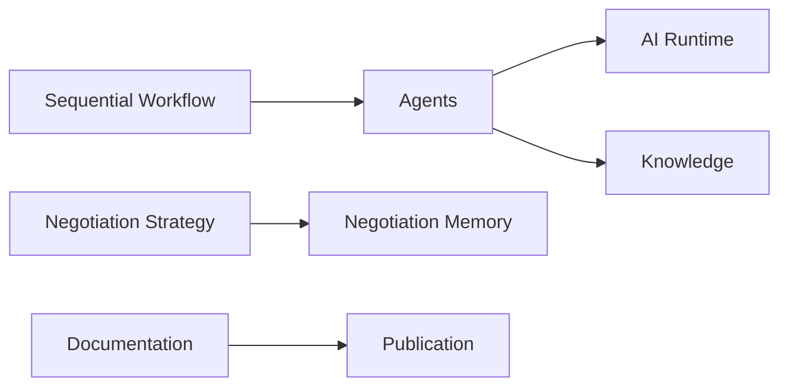
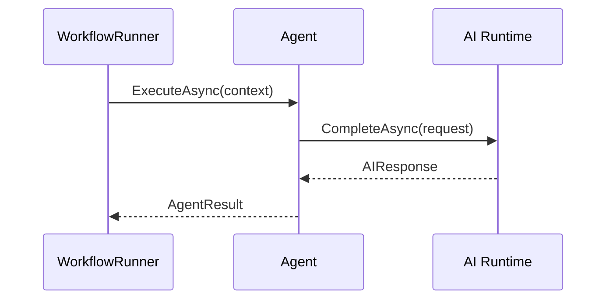

# Engineering Blueprint — SOMA BlueprintOS

> Documento oficial de engenharia. Estado comprovado em 31/07/2026; para estado operacional, consultar `PROJECT_STATE.md`.

## Índice

1. [Executive Summary](#1-executive-summary)
2. [Arquitetura Geral](#2-arquitetura-geral)
3. [Arquitetura Física](#3-arquitetura-física)
4. [Arquitetura Lógica](#4-arquitetura-lógica)
5. [Agentes de IA](#5-agentes-de-ia)
6. [Runtime](#6-runtime)
7. [Módulos](#7-módulos)
8. [Banco de Dados](#8-banco-de-dados)
9. [APIs](#9-apis)
10. [Eventos](#10-eventos)
11. [Integrações](#11-integrações)
12. [Segurança](#12-segurança)
13. [Observabilidade](#13-observabilidade)
14. [Estratégia de Testes](#14-estratégia-de-testes)
15. [Estratégia de Deploy](#15-estratégia-de-deploy)
16. [Roadmap Técnico](#16-roadmap-técnico)
17. [Work Orders](#17-work-orders)
18. [Decisões Arquiteturais](#18-decisões-arquiteturais)
19. [Padrões do Projeto](#19-padrões-do-projeto)
20. [Glossário](#20-glossário)
21. [Onboarding](#21-onboarding)
22. [Como uma IA deve trabalhar](#22-como-uma-ia-deve-trabalhar)

## 1. Executive Summary

O BlueprintOS é a fundação corporativa de IA para o +COMPRAS. Seu objetivo é concentrar capacidades reutilizáveis de IA, conhecimento, documentação e automação, sem substituir controles humanos. Hoje resolve parcialmente problemas técnicos de runtime de IA, recuperação de conhecimento Markdown, estratégia de negociação em memória e publicação documental. O público é engenharia, produto e futuramente usuários de Procurement. O valor de negócio pretendido é reduzir dispersão de conhecimento e acelerar produtos corporativos com governança.

## 2. Arquitetura Geral

O alvo é Modular Monolith, Clean Architecture e DDD pragmático. A implementação real ainda é uma solução .NET por camadas transversais; esta diferença é deliberada e registrada em ADR-0006.

Responsabilidades: Api hospeda endpoints e CLIs; Application contém casos de uso (ex.: `Procurement/Suppliers`) e Domain contém entidades reais (ex.: `Fornecedor`, `Cnpj`, `ScoreFornecedor`) do vertical slice de Fornecedores; Core contém contratos/modelos dos módulos técnicos (AI, Agents, Documentation, Knowledge, Publication); Infrastructure implementa provedores, memória e publicação. Comunicação futura entre módulos deve ocorrer por contratos, nunca por internals de Infrastructure.

### Arquitetura Frontend — Vertical Slice (ADR-0020, revisão R2)

O frontend do Portal +Compras (React/TypeScript, `frontend/web`) utiliza obrigatoriamente arquitetura **Vertical Slice**, organizada por domínio de negócio — não por tipo técnico. Não existem pastas horizontais de topo (`src/pages`, `src/components`, `src/hooks`, `src/services` abrangendo toda a aplicação); cada domínio funcional é uma fatia autônoma que agrupa internamente seus próprios `pages`, `components`, `hooks`, `services`, `routes`, `models`, `types` e `tests`.

Esta é a mesma visão arquitetural já adotada pelo backend (Modular Monolith + Clean Architecture + DDD pragmático, organização por domínio, ADR-0001), expressa no frontend por outra técnica: enquanto o backend separa por camada dentro de cada módulo (Domain/Application/Infrastructure/Api), o frontend agrupa por domínio primeiro e mantém os elementos técnicos dentro de cada slice. Frontend e Backend permanecem, assim, arquiteturalmente alinhados — ambos crescem adicionando domínio, não adicionando pasta técnica.

Estrutura conceitual de referência (não obrigatória em nomes exatos; a criação física é responsabilidade de Work Order de Estrutura futura):

Regras obrigatórias:

- Organização por domínio de negócio, nunca por tecnologia.
- Cada slice possui autonomia funcional — seus artefatos técnicos não são compartilhados por padrão com outras slices.
- Novos módulos de domínio (Fornecedores, Materiais, Solicitações, etc., conforme `.ai/ROADMAP.md`) seguem exatamente a mesma estrutura interna das slices já existentes.
- Elementos genuinamente compartilhados entre domínios (Design System AZZAS 2154/GDT, utilitários transversais) residem exclusivamente em `shared/`/`design-system/` — nunca dentro de uma slice de domínio específico.

Ver o princípio permanente correspondente em [Domain Principles](../docs/architecture/domain-principles.md#frontend) e a decisão completa em ADR-0020 (`.ai/DECISIONS.md`, seção "Arquitetura Frontend"). Esta seção documenta a decisão arquitetural aprovada; a estrutura física foi criada pela Sprint O1.2.1 em `frontend/web/src` (`core/`, `procurement/suppliers/`, `shared/components/`), com o módulo Fornecedores migrado como referência — ver `.ai/CURRENT_SPRINT.md` para o detalhe da migração e pendências (demais páginas ainda não migradas, `design-system/` ainda não criada por ausência de código real a mover).

## 3. Arquitetura Física

| Componente | Estado |
|---|---|
| Backend | Implementado: .NET 9 em `backend/src` |
| Frontend | Fundação Vertical Slice implementada em `frontend/web/src` (`core/`, `procurement/suppliers/`, `shared/components/`); módulo Fornecedores migrado como referência; demais páginas (Dashboard, Pedidos, Negociações, Indicadores, Agentes IA, Configurações) ainda na pasta horizontal `pages/`, pendentes de migração em sprints futuras |
| Banco | Implementado parcialmente: EF Core/SQL Server, `BlueprintOSDbContext`, migration de fornecedores e banco próprio +Compras |
| Agentes | Implementado: EchoAgent e KnowledgeAgent |
| Storage | Parcial: Markdown e memória em processo |
| Docker | Não usado no ambiente local (ver ADR-0018); reservado sem implementação ativa |
| Cloud | Planejado: GCP sem configuração rastreada |
| Integrações | Parcial: OpenAI, leitura de Git e descoberta de fornecedores somente leitura no ERP SOMA_DESENV; validação operacional pendente |

## 4. Arquitetura Lógica

Bounded contexts atuais: AI/Agents, Knowledge, Negotiation Memory, Workflows, Documentation, Publication e a base de fornecedores. Contextos futuros: Identity, Planner, Procurement, Notifications, Dashboard e Analytics.

## 5. Agentes de IA

| Agente | Objetivo | Entradas/Saídas | Dependências | Estado |
|---|---|---|---|---|
| EchoAgent | Referência e diagnóstico | Contexto → resposta do runtime | IA Runtime | Implementado |
| KnowledgeAgent | Responder com conhecimento recuperado | Consulta/contexto → resposta | IA Runtime, KnowledgeService | Implementado |

Não há SeniorBuyerAgent, NegotiationAgent, ComplianceAgent ou RiskAgent concretos. Não há ferramentas, eventos, filas ou estados de agente persistidos além do fluxo em memória.

## 6. Runtime

`IAIRuntime` abstrai chamadas de IA e seleciona implementações de `IAIProvider` pelo provedor do modelo solicitado. `OpenAIProvider` é o adaptador atualmente implementado para Chat Completions; ele não é dependência de Domain, Application ou agentes. Pela ADR-0014, Ollama local é o padrão arquitetural de Development e a plataforma corporativa é a única estratégia de Produção; ambos devem ser fornecidos por adaptadores configuráveis. `AgentFactory` cria agentes via reflexão. `WorkflowRunner` executa passos sequenciais. Planejamento autônomo, orquestrador distribuído, eventos, fila e pipeline de execução são planejados, não implementados.

## 7. Módulos

| Módulo | Responsabilidade | Dependências | Status/Roadmap |
|---|---|---|---|
| AI Runtime | Contratos e seleção de adaptadores LLM | `IAIProvider`/`IAIRuntime`; OpenAI implementado; Ollama planejado para Development | Implementado, extensível |
| Agents | Agentes básicos e factory | Runtime, Knowledge | Implementado |
| Knowledge | Busca em Markdown | Arquivos | Implementado, básico |
| Memory/Negotiation | Histórico e score de negociação | Em memória | Parcial |
| Workflows | Execução sequencial | Agents | Parcial |
| Documentation | Geração e publicação de docs | Git, arquivos | Implementado |
| Publication | Markdown/HTML/PDF | QuestPDF, QRCoder | Implementado |
| Identity, Planner, Procurement, Notifications, Dashboard, Analytics | Domínios de produto | A detalhar | Planejado/Não iniciado |

## 8. Banco de Dados

SQL Server e EF Core são usados pela base de fornecedores no +Compras, com `BlueprintOSDbContext`, migration e conexões segregadas do banco próprio e do ERP. O ERP SOMA_DESENV é consultado somente por adaptador de descoberta; sua validação operacional depende de rede. Itens, pedidos, relacionamentos operacionais completos e migrações futuras permanecem planejados. A ADR-0013 define o ERP como fonte corporativa e o +Compras como fonte dos dados e relacionamentos próprios.

**Estratégia de banco durante o MVP 1.0 (registrada no replanejamento Frontend First):** durante as Ondas 1 a 4, tabelas, migrations, FKs e relacionamentos podem evoluir livremente sem compromisso de estabilidade de schema. Antes da Onda 5 (Go Live), toda estrutura integrada ao ERP deve reproduzir exatamente o ERP como modelo estrutural canônico — nomes, tipos, precisão, escala, tamanho, collate, PK, FK, índices e regras de negócio compatíveis; nunca criar estrutura própria diferente quando já existir equivalente no ERP. Detalhe em `.ai/ROADMAP.md`.

**Blueprint funcional da Onda 1 (ADR-0020):** `docs/product/ComprasDataModel.md` acrescenta as entidades `UnidadeAlocacao`, `Filial`, `CentroCusto`, `CentroCustoUnidadeAlocacao` e `UsuarioCentroCusto` ao blueprint funcional já existente (`UnidadeNegocio`, `Usuario`, `Perfil`, `Permissao` etc.). São blueprint funcional, não modelo físico — migrations reais só são criadas por Work Order de Estrutura futura.

## 9. APIs

APIs atuais incluem `GET /health`, CRUD REST de fornecedores, descoberta de fornecedores e recomendação de negociação consultiva; OpenAPI existe em desenvolvimento. Autenticação corporativa, APIs de itens/pedidos e contratos completos de Procurement permanecem futuros. O padrão é REST/JSON, contratos estáveis e não exposição de entidades.

## 10. Eventos

Não há catálogo de eventos, publicadores ou consumidores implementados. Domain Events são um padrão arquitetural alvo; qualquer evento futuro deve declarar publicador, consumidores, contrato e idempotência.

## 11. Integrações

| Integração | Estado |
|---|---|
| OpenAI Chat Completions | Adaptador atual de Infrastructure, preservado por compatibilidade |
| Ollama local | Padrão arquitetural para Development; adaptador ainda não implementado |
| Plataforma corporativa de IA | Estratégia obrigatória de Produção; fornecedor e adaptador dependem da Infraestrutura |
| Git CLI | Implementado somente para leitura documental |
| ERP SOMA_DESENV | Descoberta de fornecedores somente leitura; validação operacional pendente |
| Microsoft 365, Google, n8n, RAG vetorial e provedores futuros | Planejado |

**Estratégia de integração com ERP (registrada no replanejamento Frontend First):** o ERP nunca sofre alteração estrutural — `CREATE`, `ALTER`, `DROP`, triggers, CDC, Change Tracking, criação de índices ou qualquer alteração física são proibidos. A única escrita permitida é via tabelas e contratos oficiais já existentes. Toda integração da Onda 4 exige auditoria técnica prévia da tabela ERP envolvida (estratégia de sincronização, desempenho, custo, impacto, riscos, recomendação técnica) antes de ser implementada.

## 12. Segurança

Entra ID, multi-tenant, LGPD, auditoria são requisitos planejados. Autorização por perfil segue o modelo decidido pela ADR-0020: **RBAC exclusivo por perfil** — todo usuário recebe acesso exclusivamente por um ou mais Perfis; suas permissões efetivas são a união das permissões de todos os perfis vinculados; usuários nunca recebem permissão individual ou exceção direta (necessidade diferente exige criação de um novo perfil). Hoje segredos seguem configuração de ambiente; não há autenticação/autorização de aplicação implementada nem trilha de auditoria.

**Arquitetura de login e multiempresa (registrada no replanejamento Frontend First):** o roteamento ocorre sempre por `UnidadeNegocioId`, sob a URL base `https://maiscompras.somagrupo.com.br/{unidade}` (ex.: `/soma`, `/reserva`, `/hering`, `/arezzo`). Cada Unidade de Negócio pode possuir um ou mais Identity Providers; a autenticação permanece desacoplada do domínio de negócio, permitindo adicionar novos métodos de login sem alterar a arquitetura. Multiempresa por `UnidadeNegocioId` se estende a Multi ERP, Multi Login, Workflow, Aprovação, Controle Orçamentário e Identity Provider — todos escopados por Unidade de Negócio. A primeira implantação (Onda 1) utiliza somente `UnidadeNegocioId = SOMA`, sem comprometer a arquitetura multiempresa, que permanece preparada para expansão. Detalhe em `.ai/ROADMAP.md` e `ARCHITECTURE.md` §16.

**Cadastros integrados do ERP (ADR-0020):** o ERP permanece fonte canônica; dados sincronizados (Filiais, Centros de Custo) são imutáveis no +Compras, que só armazena metadados locais (`DescricaoMaisCompras`, `AtivoNoMaisCompras`). Unidades de Alocação substituem o conceito informal de "Gestão de Empresas" como classificação gerencial de despesa. Nomes de tela oficiais: "Gestão de Filiais" e "Gestão de Centros de Custo" — nunca "Cadastro de...".

**Autenticação — Login Passwordless via OTP (ADR-0020, atualização R1.2):** o mecanismo de login da Onda 1 é OTP (código de verificação) por e-mail corporativo, sem senha. Regras: domínio de e-mail deve pertencer a domínio autorizado pela Unidade de Negócio/Identity Provider; apenas usuário Ativo autentica; a sessão sempre resolve o vínculo com uma Unidade de Negócio; uma Unidade de Negócio pode ter múltiplos Identity Providers simultâneos; o Microsoft Entra ID, quando disponível, coexiste com o OTP por e-mail como Identity Providers alternativos, sem substituí-lo compulsoriamente.

**Bootstrap Mode (ADR-0020, atualização R1.2):** modo de inicialização disponível somente enquanto não existir nenhum Administrador Sênior cadastrado; permite criar a primeira Unidade de Negócio, o primeiro Administrador Sênior e a configuração inicial mínima. Encerra-se permanentemente após a criação do primeiro Administrador Sênior — não é reaberto por perda de acesso posterior; recuperação de acesso nesse cenário é procedimento operacional de suporte, fora do Bootstrap Mode.

**Requisito de processo para autenticação (ADR-0020, atualização R1.2):** toda funcionalidade de autenticação (Login, OTP, Identity Providers, Bootstrap Mode, sessão) exige revisão arquitetural do Agente Engenheiro de Segurança Sênior antes da implementação e validação de segurança dedicada depois — condição obrigatória para que a funcionalidade seja considerada "Pronta" (`ROADMAP.md`).

**Security Design Review — O1.4.1 (06/08/2026):** revisão arquitetural de segurança exigida pelo requisito de processo acima, concluída sem nenhuma implementação de código. Define arquitetura recomendada (sessão persistida server-side + cookie `HttpOnly/Secure/SameSite=Strict`, RBAC resolvido por requisição sem cache de longa duração), threat model completo e controles obrigatórios de OTP/sessão/Bootstrap/headers/CORS/CSRF/auditoria. Documento: `docs/architecture/security-design-auth-o1.4.md`. **Security Design Gate: Aprovado com pendências** — implementação (O1.4.2) bloqueada até o Product Owner/Infra resolverem: catálogo de Perfis/Permissões (incl. "Administrador Sênior"), provedor transacional de e-mail para OTP, e escopo de `Perfil`/`Permissao` (global vs. por Unidade de Negócio).

**Estratégia de Autenticação em Development — O1.4.1.1 (07/08/2026):** complemento formal da O1.4.1, formalizando a **Development Auth Strategy** aprovada com ajustes pelo Product Owner, sem nenhuma implementação de código. Define: fase Frontend First sem solicitação de integração corporativa (Entra ID/e-mail) à Infra neste momento; contrato `IOtpEmailSender` exclusivo para envio de OTP, desconhecido pelo domínio quanto ao provider; `DevelopmentOtpEmailSender` estritamente restrito a Development, sem fallback automático, com fail-closed em qualquer outro ambiente sem provider corporativo válido; defesa em profundidade obrigatória por `IHostEnvironment` + `ValidateOnStart()` (múltiplas checagens de `IsDevelopment()` isoladas não contam como defesa independente); proibição absoluta de exposição do OTP em log/API/UI/arquivo/telemetria/auditoria, inclusive em Development; **Authentication Infra Readiness Gate** obrigatório antes de Homologação (provider corporativo, integração real de envio, secrets corporativos, Entra ID/App Registration, headers/CORS/CSRF/rate limiting, secret scanning, runbook, rotação de credenciais); Entra ID/Microsoft Graph postergados, não descartados. Documento: `docs/architecture/security-design-auth-o1.4.md`, seção 17. **Efeito sobre o Security Design Gate:** o bloqueador do provedor de e-mail deixa de impedir o início de O1.4.2 e passa a ser exigido apenas antes de Homologação; os bloqueadores de catálogo de Perfis/Permissões e escopo de `Perfil`/`Permissao` permanecem pendentes de decisão do Product Owner.

**O1.4.2 — Login Passwordless OTP e Sessão Segura (07/08/2026):** implementação técnica concluída — Vertical Slice de autenticação no backend (`Domain/Identity`, `Application/Identity`, `Infrastructure/Identity`, `Api/Auth`/`Api/Identity`) e no frontend (`auth/`), com OTP hash+salt/uso único/rate limiting, sessão server-side com cookie `HttpOnly/Secure/SameSite=Strict`, `DevelopmentOtpEmailSender` exclusivo de Development com fail-closed fora dele, CSRF/CORS/headers de segurança, e `RequireAuth` como guarda de rota. 275/275 testes de backend e 38/38 de frontend aprovados. **Não marcada como "Pronta"** — pendente de Security Validation dedicada e aprovação do Product Owner (ADR-0020, item 13). Detalhe completo em `.ai/CURRENT_SPRINT.md`.

**O1.4.2.1 — Security Hardening da Autenticação OTP (07/08/2026):** resposta à Security Validation adversarial da O1.4.2 (Gate: Aprovado com pendências). Fecha os 4 achados ALTO — rate limiting por e-mail normalizado (complementar ao IP), consumo único atômico de OTP via RowVersion + índice único filtrado, `AuthorizationOptions.FallbackPolicy` (secure-by-default, anônimo como exceção explícita) com dois authentication handlers por ambiente, e defesa redundante interna em `/dev/otp` — e o achado de cobertura de testes (fail-closed comprovado por host real, concorrência real via `Task.WhenAll`). 275→294 testes de backend, todos aprovados; frontend sem regressão. **Não conclui a O1.4.2** — aguarda nova Security Validation independente. Detalhe: `docs/architecture/security-design-auth-o1.4.md`, seção 18.

**Último Gate:** Gate Administrativo — **Status: Aprovado** (06/08/2026, encerrando a fundação administrativa da Onda 1: Perfis, Usuários, Filiais, Centros de Custo, Unidades de Alocação). **Próxima fase:** Autenticação (O1.4) — O1.4.1 e O1.4.1.1 concluídas; **O1.4.2 (implementação) liberada para início sem dependência imediata da Infra**, condicionada aos bloqueadores remanescentes de catálogo de Perfis/Permissões e escopo de `Perfil`/`Permissao`, e à ratificação do modelo de sessão pelo Product Owner/CTO.

## 13. Observabilidade

Há endpoint de health e métricas de qualidade durante publicação. Logging estruturado, tracing, métricas operacionais, alertas e observabilidade de produção não estão implementados.

## 14. Estratégia de Testes

Suíte atual: xUnit com fakes manuais, 290 testes unitários e 5 de integração aprovados na última validação (05/08/2026). Cobertura futura: integração, arquitetura, contrato e E2E. E2E, testes de contrato e testes arquiteturais não existem.

## 15. Estratégia de Deploy

O ambiente local roda sem Docker (backend via `dotnet run`, frontend via `npm run dev`; ver ADR-0018). CI/CD, ambientes, promoção, versionamento operacional, Kubernetes e GCP são planejados.

## 16. Roadmap Técnico

O projeto foi oficialmente replanejado para o **MVP 1.0** segundo a estratégia Frontend First, consolidada como estratégia definitiva de desenvolvimento: `Ideia → +Compras Funcional → Validação de negócio → UX → Mock navegável → Blueprint do Banco → APIs → Integrações → Implementação → Testes → Homologação`. Nenhuma funcionalidade é implementada antes da aprovação do Mock navegável. Detalhe completo das Ondas, Gates de aprovação, política de datas e definição oficial de "Pronto" em `.ai/ROADMAP.md`; reclassificação do catálogo de 56 Work Orders por Onda/versão em `.ai/BACKLOG.md`. A arquitetura abaixo não muda em função deste replanejamento; mudanças estruturais futuras só ocorrem por necessidade real identificada durante a implementação.

| Onda MVP 1.0 | Objetivo/resultado | Dependências | Valor | Estado |
|---|---|---|---|---|
| Fundação arquitetural (concluída) | Base técnica, padrões, Publication Engine, governança de Work Orders | — | Reduz risco | Concluída |
| Onda 1 — Fundação Funcional | Frontend navegável, Administração, blueprint de banco | Fundação arquitetural | Produto navegável | Planejado |
| Onda 2 — Cadastros | Fornecedores (concluído), itens, categorias, compradores, centros de custo, sincronização ERP | Onda 1 | Cadastros completos | Parcial (fornecedores) |
| Onda 3 — Processo de Compras | Solicitação, cotação, negociação IA, workflow, orçamento, aprovação, pedido | Onda 2 | Fluxo operacional utilizável | Planejado |
| Onda 4 — Integrações Operacionais | ERP, Nota Fiscal, Pagamento | Onda 3 | Integração ponta a ponta | Planejado |
| Onda 5 — Go Live | Homologação, observabilidade, performance, segurança | Ondas 1–4 | Produção estável | Planejado |
| MVP 1.1 | ESG, Portal de Fornecedores, Marketplace, Analytics avançado, Previsão de Demanda/Preços, Jurídico, Compliance, Gestão de Riscos | MVP 1.0 | Capacidades avançadas | Planejado, fora do escopo do MVP 1.0 |

## 17. Work Orders

Há 56 Work Orders estratégicas nas fases A–H, além das sprints de governança A10–A12. A1–A4 e A7 são comprovadas; A5 não é comprovada e A6 é parcial; B1, B2, B2.1, B2.1.1, B2.1.2, B2.1.3 e B2.2 estão concluídas (ver `.ai/BACKLOG.md` para evidências detalhadas); B3 não foi iniciada. A ADR-0013 prioriza plataforma operacional antes da inteligência. `BACKLOG.md`, `work-orders/backlog/README.md` e `DEPENDENCY_MAP.md` consolidam catálogo e dependências.

## 18. Decisões Arquiteturais

`DECISIONS.md` é o log canônico: ADR-0001 arquitetura; 0002 stack; 0003 CQRS/MediatR/Domain Events; 0004 Result Pattern; 0005 Contracts entre módulos; 0006 estrutura atual; 0007 renderização comum; 0008 documento rico; 0009 organização de docs (substituída pela 0019); 0011 identidade temporária; 0012 persistência de fornecedores; 0013 evolução operacional e inteligente; 0014 estratégia de LLM desacoplada; 0015 contrato canônico e sincronização de fornecedores; 0016 modelo canônico de fornecedor Linx; 0017 estratégia do Portal Operacional; 0018 ambiente de execução local; 0019 `docs/` como fonte canônica por domínio; 0020 modelo administrativo (Administração/Administração do Sistema/Configurações), cadastros integrados do ERP (Filiais, Centros de Custo, Unidades de Alocação), segurança RBAC exclusiva por perfil, Login Passwordless via OTP e Bootstrap Mode (atualizada pela revisão R1.2), e arquitetura Frontend Vertical Slice obrigatória (atualizada pela revisão R2). A política de autonomia é registrada em `memory/decisions.md` como decisão operacional, não ADR.

**Domain Principles:** [docs/architecture/domain-principles.md](../docs/architecture/domain-principles.md) é o documento oficial e permanente de princípios do domínio de negócio do +Compras (plataforma, dados mestres, administração, cadastros integrados, segurança) — consolidação de leitura rápida das regras já aprovadas por ADR, sem histórico e sem duplicar o conteúdo das ADRs. Em caso de conflito, a ADR correspondente sempre prevalece sobre o Domain Principles.

## 19. Padrões do Projeto

Código em inglês e documentação em português. Aplicar DDD pragmático, SOLID, Clean Architecture, DI, async/await, CancellationToken, ILogger, Result Pattern, testes e nomes PascalCase. Branches e commits seguem `STANDARDS.md`; documentação e decisões relevantes devem acompanhar a alteração.

## 20. Glossário

- **BlueprintOS:** plataforma corporativa de IA.
- **+COMPRAS:** produto de Procurement planejado sobre a plataforma.
- **Work Order:** escopo aprovado e testável de uma sprint.
- **Agent:** componente que executa uma tarefa usando o runtime de IA.
- **Runtime:** abstração de execução contra provedor de LLM.
- **Knowledge:** recuperação de conteúdo organizacional.
- **Memory:** contexto retido entre operações; hoje limitado à negociação em processo.
- **Implemented/Partial/Planned:** estados de evidência, não sinônimos.

## 21. Onboarding

1. Ler `PROJECT.md`, `VISION.md`, `PROJECT_STATE.md`, `ARCHITECTURE.md`, `STANDARDS.md`, `WORKFLOW.md` e `AI_AUTONOMY_POLICY.md`.
2. Ler `CURRENT_SPRINT.md` e a Work Order aprovada.
3. Rodar `dotnet build backend/BlueprintOS.sln` e `dotnet test backend/BlueprintOS.sln`.
4. Implementar somente o escopo aprovado, atualizar documentação e validar antes do commit.

## 22. Como uma IA deve trabalhar

Antes de implementar, a IA lê VISION, PROJECT_STATE, este Blueprint, CURRENT_SPRINT e Work Order. Ela verifica evidência, impacto e testes; respeita a política de autonomia; executa somente uma Work Order Approved; registra melhorias fora de escopo sem implementá-las; ao concluir, atualiza estado, histórico e documentação, valida build/testes e realiza commit/push. Em dúvida, interrompe e solicita aprovação.
