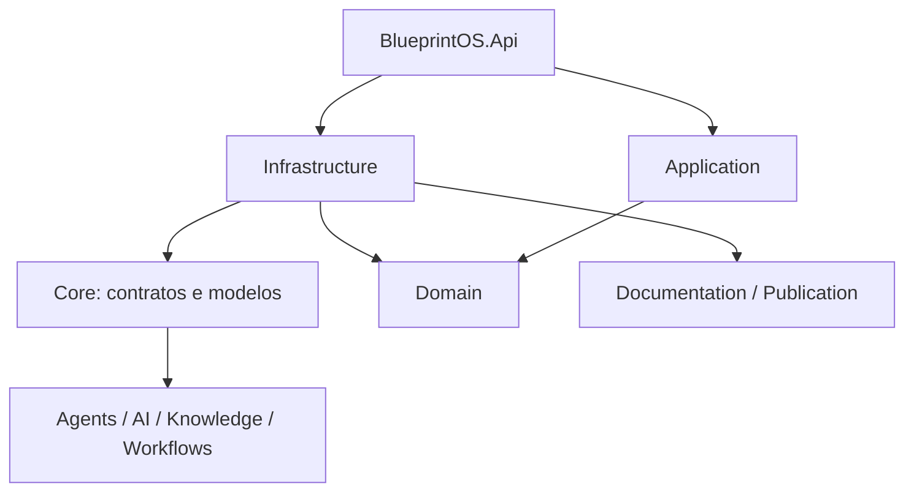
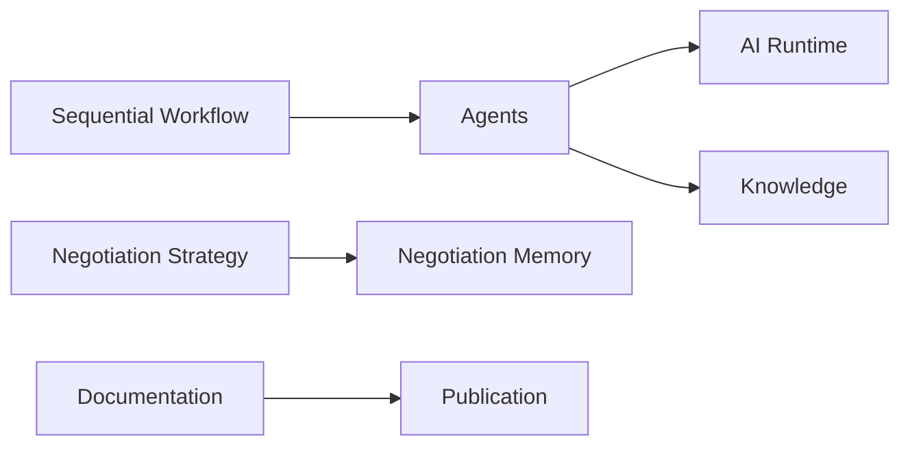
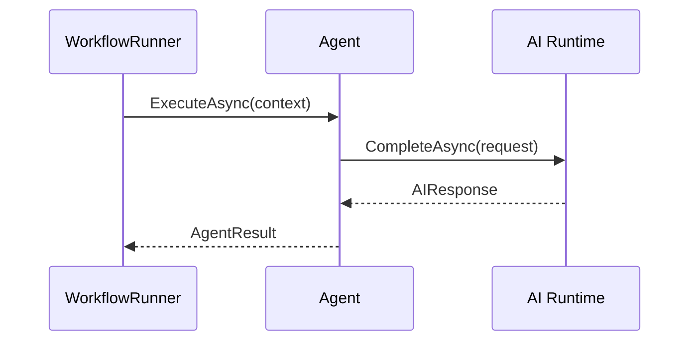

# Engineering Blueprint — SOMA BlueprintOS

> Documento oficial de engenharia. Estado comprovado em 31/07/2026; para estado operacional, consultar `PROJECT_STATE.md`.

## Índice

1. [Executive Summary](#1-executive-summary)
2. [Arquitetura Geral](#2-arquitetura-geral)
3. [Arquitetura Física](#3-arquitetura-física)
4. [Arquitetura Lógica](#4-arquitetura-lógica)
5. [Agentes de IA](#5-agentes-de-ia)
6. [Runtime](#6-runtime)
7. [Módulos](#7-módulos)
8. [Banco de Dados](#8-banco-de-dados)
9. [APIs](#9-apis)
10. [Eventos](#10-eventos)
11. [Integrações](#11-integrações)
12. [Segurança](#12-segurança)
13. [Observabilidade](#13-observabilidade)
14. [Estratégia de Testes](#14-estratégia-de-testes)
15. [Estratégia de Deploy](#15-estratégia-de-deploy)
16. [Roadmap Técnico](#16-roadmap-técnico)
17. [Work Orders](#17-work-orders)
18. [Decisões Arquiteturais](#18-decisões-arquiteturais)
19. [Padrões do Projeto](#19-padrões-do-projeto)
20. [Glossário](#20-glossário)
21. [Onboarding](#21-onboarding)
22. [Como uma IA deve trabalhar](#22-como-uma-ia-deve-trabalhar)

## 1. Executive Summary

O BlueprintOS é a fundação corporativa de IA para o +COMPRAS. Seu objetivo é concentrar capacidades reutilizáveis de IA, conhecimento, documentação e automação, sem substituir controles humanos. Hoje resolve parcialmente problemas técnicos de runtime de IA, recuperação de conhecimento Markdown, estratégia de negociação em memória e publicação documental. O público é engenharia, produto e futuramente usuários de Procurement. O valor de negócio pretendido é reduzir dispersão de conhecimento e acelerar produtos corporativos com governança.

## 2. Arquitetura Geral

O alvo é Modular Monolith, Clean Architecture e DDD pragmático. A implementação real ainda é uma solução .NET por camadas transversais; esta diferença é deliberada e registrada em ADR-0006.

Responsabilidades: Api hospeda endpoints e CLIs; Application contém casos de uso (ex.: `Procurement/Suppliers`) e Domain contém entidades reais (ex.: `Fornecedor`, `Cnpj`, `ScoreFornecedor`) do vertical slice de Fornecedores; Core contém contratos/modelos dos módulos técnicos (AI, Agents, Documentation, Knowledge, Publication); Infrastructure implementa provedores, memória e publicação. Comunicação futura entre módulos deve ocorrer por contratos, nunca por internals de Infrastructure.

## 3. Arquitetura Física

| Componente | Estado |
|---|---|
| Backend | Implementado: .NET 9 em `backend/src` |
| Frontend | Não iniciado: diretórios existem sem aplicação React |
| Banco | Implementado parcialmente: EF Core/SQL Server, `BlueprintOSDbContext`, migration de fornecedores e banco próprio +Compras |
| Agentes | Implementado: EchoAgent e KnowledgeAgent |
| Storage | Parcial: Markdown e memória em processo |
| Docker | Não usado no ambiente local (ver ADR-0018); reservado sem implementação ativa |
| Cloud | Planejado: GCP sem configuração rastreada |
| Integrações | Parcial: OpenAI, leitura de Git e descoberta de fornecedores somente leitura no ERP SOMA_DESENV; validação operacional pendente |

## 4. Arquitetura Lógica

Bounded contexts atuais: AI/Agents, Knowledge, Negotiation Memory, Workflows, Documentation, Publication e a base de fornecedores. Contextos futuros: Identity, Planner, Procurement, Notifications, Dashboard e Analytics.

## 5. Agentes de IA

| Agente | Objetivo | Entradas/Saídas | Dependências | Estado |
|---|---|---|---|---|
| EchoAgent | Referência e diagnóstico | Contexto → resposta do runtime | IA Runtime | Implementado |
| KnowledgeAgent | Responder com conhecimento recuperado | Consulta/contexto → resposta | IA Runtime, KnowledgeService | Implementado |

Não há SeniorBuyerAgent, NegotiationAgent, ComplianceAgent ou RiskAgent concretos. Não há ferramentas, eventos, filas ou estados de agente persistidos além do fluxo em memória.

## 6. Runtime

`IAIRuntime` abstrai chamadas de IA e seleciona implementações de `IAIProvider` pelo provedor do modelo solicitado. `OpenAIProvider` é o adaptador atualmente implementado para Chat Completions; ele não é dependência de Domain, Application ou agentes. Pela ADR-0014, Ollama local é o padrão arquitetural de Development e a plataforma corporativa é a única estratégia de Produção; ambos devem ser fornecidos por adaptadores configuráveis. `AgentFactory` cria agentes via reflexão. `WorkflowRunner` executa passos sequenciais. Planejamento autônomo, orquestrador distribuído, eventos, fila e pipeline de execução são planejados, não implementados.

## 7. Módulos

| Módulo | Responsabilidade | Dependências | Status/Roadmap |
|---|---|---|---|
| AI Runtime | Contratos e seleção de adaptadores LLM | `IAIProvider`/`IAIRuntime`; OpenAI implementado; Ollama planejado para Development | Implementado, extensível |
| Agents | Agentes básicos e factory | Runtime, Knowledge | Implementado |
| Knowledge | Busca em Markdown | Arquivos | Implementado, básico |
| Memory/Negotiation | Histórico e score de negociação | Em memória | Parcial |
| Workflows | Execução sequencial | Agents | Parcial |
| Documentation | Geração e publicação de docs | Git, arquivos | Implementado |
| Publication | Markdown/HTML/PDF | QuestPDF, QRCoder | Implementado |
| Identity, Planner, Procurement, Notifications, Dashboard, Analytics | Domínios de produto | A detalhar | Planejado/Não iniciado |

## 8. Banco de Dados

SQL Server e EF Core são usados pela base de fornecedores no +Compras, com `BlueprintOSDbContext`, migration e conexões segregadas do banco próprio e do ERP. O ERP SOMA_DESENV é consultado somente por adaptador de descoberta; sua validação operacional depende de rede. Itens, pedidos, relacionamentos operacionais completos e migrações futuras permanecem planejados. A ADR-0013 define o ERP como fonte corporativa e o +Compras como fonte dos dados e relacionamentos próprios.

## 9. APIs

APIs atuais incluem `GET /health`, CRUD REST de fornecedores, descoberta de fornecedores e recomendação de negociação consultiva; OpenAPI existe em desenvolvimento. Autenticação corporativa, APIs de itens/pedidos e contratos completos de Procurement permanecem futuros. O padrão é REST/JSON, contratos estáveis e não exposição de entidades.

## 10. Eventos

Não há catálogo de eventos, publicadores ou consumidores implementados. Domain Events são um padrão arquitetural alvo; qualquer evento futuro deve declarar publicador, consumidores, contrato e idempotência.

## 11. Integrações

| Integração | Estado |
|---|---|
| OpenAI Chat Completions | Adaptador atual de Infrastructure, preservado por compatibilidade |
| Ollama local | Padrão arquitetural para Development; adaptador ainda não implementado |
| Plataforma corporativa de IA | Estratégia obrigatória de Produção; fornecedor e adaptador dependem da Infraestrutura |
| Git CLI | Implementado somente para leitura documental |
| ERP SOMA_DESENV | Descoberta de fornecedores somente leitura; validação operacional pendente |
| Microsoft 365, Google, n8n, RAG vetorial e provedores futuros | Planejado |

## 12. Segurança

Entra ID, autorização por perfil, multi-tenant, LGPD, auditoria e permissões são requisitos planejados. Hoje segredos seguem configuração de ambiente; não há autenticação/autorização de aplicação nem trilha de auditoria.

## 13. Observabilidade

Há endpoint de health e métricas de qualidade durante publicação. Logging estruturado, tracing, métricas operacionais, alertas e observabilidade de produção não estão implementados.

## 14. Estratégia de Testes

Suíte atual: xUnit com fakes manuais, 290 testes unitários e 5 de integração aprovados na última validação (05/08/2026). Cobertura futura: integração, arquitetura, contrato e E2E. E2E, testes de contrato e testes arquiteturais não existem.

## 15. Estratégia de Deploy

O ambiente local roda sem Docker (backend via `dotnet run`, frontend via `npm run dev`; ver ADR-0018). CI/CD, ambientes, promoção, versionamento operacional, Kubernetes e GCP são planejados.

## 16. Roadmap Técnico

| Fase | Objetivo/resultado | Dependências | Valor | Estado |
|---|---|---|---|---|
| 0 Fundação | Base técnica e documentação | Qualidade/governança | Reduz risco | Parcial |
| 1 Core | Identity, Planner, motor de processo | Fase 0 | Capacidades de produto | Planejado |
| 2 Conhecimento/Memória | Memória corporativa e agentes | Persistência | Contexto reutilizável | Parcial |
| 3 Automação | Plataforma operacional +Compras e integrações | Fornecedores, itens e pedidos | Fluxo operacional utilizável antes da inteligência | Parcial |
| 4 Escala | Observabilidade e analytics | Operação | Produção escalável | Não iniciado |

## 17. Work Orders

Há 56 Work Orders estratégicas nas fases A–H, além das sprints de governança A10–A12. A1–A4 e A7 são comprovadas; A5 não é comprovada e A6 é parcial; B1, B2, B2.1, B2.1.1, B2.1.2, B2.1.3 e B2.2 estão concluídas (ver `.ai/BACKLOG.md` para evidências detalhadas); B3 não foi iniciada. A ADR-0013 prioriza plataforma operacional antes da inteligência. `BACKLOG.md`, `work-orders/backlog/README.md` e `DEPENDENCY_MAP.md` consolidam catálogo e dependências.

## 18. Decisões Arquiteturais

`DECISIONS.md` é o log canônico: ADR-0001 arquitetura; 0002 stack; 0003 CQRS/MediatR/Domain Events; 0004 Result Pattern; 0005 Contracts entre módulos; 0006 estrutura atual; 0007 renderização comum; 0008 documento rico; 0009 organização de docs; 0011 identidade temporária; 0012 persistência de fornecedores; 0013 evolução operacional e inteligente; 0014 estratégia de LLM desacoplada. A política de autonomia é registrada em `memory/decisions.md` como decisão operacional, não ADR.

## 19. Padrões do Projeto

Código em inglês e documentação em português. Aplicar DDD pragmático, SOLID, Clean Architecture, DI, async/await, CancellationToken, ILogger, Result Pattern, testes e nomes PascalCase. Branches e commits seguem `STANDARDS.md`; documentação e decisões relevantes devem acompanhar a alteração.

## 20. Glossário

- **BlueprintOS:** plataforma corporativa de IA.
- **+COMPRAS:** produto de Procurement planejado sobre a plataforma.
- **Work Order:** escopo aprovado e testável de uma sprint.
- **Agent:** componente que executa uma tarefa usando o runtime de IA.
- **Runtime:** abstração de execução contra provedor de LLM.
- **Knowledge:** recuperação de conteúdo organizacional.
- **Memory:** contexto retido entre operações; hoje limitado à negociação em processo.
- **Implemented/Partial/Planned:** estados de evidência, não sinônimos.

## 21. Onboarding

1. Ler `PROJECT.md`, `VISION.md`, `PROJECT_STATE.md`, `ARCHITECTURE.md`, `STANDARDS.md`, `WORKFLOW.md` e `AI_AUTONOMY_POLICY.md`.
2. Ler `CURRENT_SPRINT.md` e a Work Order aprovada.
3. Rodar `dotnet build backend/BlueprintOS.sln` e `dotnet test backend/BlueprintOS.sln`.
4. Implementar somente o escopo aprovado, atualizar documentação e validar antes do commit.

## 22. Como uma IA deve trabalhar

Antes de implementar, a IA lê VISION, PROJECT_STATE, este Blueprint, CURRENT_SPRINT e Work Order. Ela verifica evidência, impacto e testes; respeita a política de autonomia; executa somente uma Work Order Approved; registra melhorias fora de escopo sem implementá-las; ao concluir, atualiza estado, histórico e documentação, valida build/testes e realiza commit/push. Em dúvida, interrompe e solicita aprovação.
