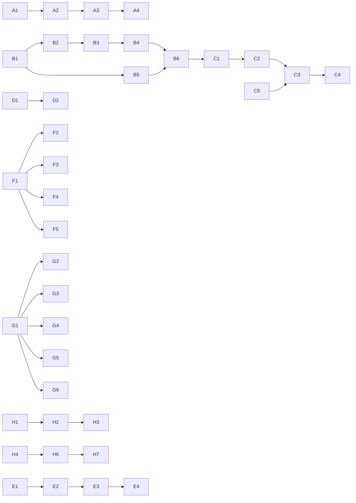

# Work Orders — Catálogo Estratégico (Backlog)

Este índice é a fonte navegável do catálogo estratégico de Work Orders (fases A–H) ainda não concluídas ou parcialmente comprovadas. Itens já concluídos foram consolidados em [`../completed/`](../completed/). O [BACKLOG](../../BACKLOG.md) é a visão consolidada com objetivos e evidências.

> **Reclassificação oficial (MVP 1.0 / MVP 1.1):** o projeto foi replanejado segundo a estratégia Frontend First. Cada código deste catálogo foi reclassificado por Onda do MVP 1.0 ou por versão 1.1 — ver a tabela em [`../../BACKLOG.md`](../../BACKLOG.md#reclassificação-oficial--mvp-10-e-mvp-11-replanejamento-frontend-first) e o roadmap completo em [`../../ROADMAP.md`](../../ROADMAP.md). Esta reclassificação não altera dependências, status ou evidências registrados abaixo.

## Legenda

- **Implementado / Concluída:** evidência em código, testes ou Git — consultar [`../completed/`](../completed/), não listado aqui.
- **Parcial / Não comprovado:** capacidade ou referência histórica incompleta.
- **Planejado:** especificada, ainda não aprovada.

## Work Orders planejadas, parciais ou não comprovadas

| Código | Fase | Nome | Status | Dependências | Work Order |
|---|---|---|---|---|---|
| A5 | Foundation | Configuração Multiempresa | Não comprovado | A1; Identity e persistência futuras. | [A5](fase-a/A5-configuracao-multiempresa.md) |
| A6 | Foundation | Agente Comprador Sênior | Parcial | A2 e A3. | [A6](fase-a/A6-agente-comprador-senior.md) |
| B3 | Sourcing Intelligence | Cadastro e Integração de Itens | Planejado | B1; B2.1 recomendada. | [B3](fase-b/B3-historico-de-compras.md) |
| B4 | Sourcing Intelligence | Compras e Pedidos Operacionais | Planejado | B3. | [B4](fase-b/B4-inteligencia-de-precos.md) |
| B5 | Sourcing Intelligence | Portal Operacional Integrado | Planejado | B1 a B4. | [B5](fase-b/B5-descoberta-e-qualificacao-de-fornecedores.md) |
| B6 | Sourcing Intelligence | Integrações ERP por BU | Planejado | B3 e B4. | [B6](fase-b/B6-recomendacao-de-sourcing.md) |
| B7 | Sourcing Intelligence | Fluxo Operacional Ponta a Ponta | Planejado | B1 a B6. | [B7](fase-b/B7-cockpit-de-sourcing.md) |
| C1 | Negotiation Automation | Dossiê de Negociação | Planejado | B1, B3, B4 e B6. | [C1](fase-c/C1-dossie-de-negociacao.md) |
| C2 | Negotiation Automation | Planejador de Negociação | Planejado | C1. | [C2](fase-c/C2-planejador-de-negociacao.md) |
| C3 | Negotiation Automation | Agente de Negociação | Planejado | C2 e C5. | [C3](fase-c/C3-agente-de-negociacao.md) |
| C4 | Negotiation Automation | Memória Persistente de Negociação | Planejado | C3; persistência proposta. | [C4](fase-c/C4-memoria-persistente-de-negociacao.md) |
| C5 | Negotiation Automation | Aprovações e Alçadas | Planejado | H1 e H2 propostos. | [C5](fase-c/C5-aprovacoes-e-alcadas.md) |
| C6 | Negotiation Automation | Avaliação de Resultado | Planejado | C1, C3 e C4. | [C6](fase-c/C6-avaliacao-de-resultado.md) |
| C7 | Negotiation Automation | Central de Negociações | Planejado | C1 a C6; H1/H2 propostos. | [C7](fase-c/C7-central-de-negociacoes.md) |
| D1 | Contract & Compliance | Integração com Plataforma Jurídica | Planejado | G1; plataforma jurídica a aprovar. | [D1](fase-d/D1-integracao-com-plataforma-juridica.md) |
| D2 | Contract & Compliance | Obrigações e Marcos Contratuais | Planejado | D1. | [D2](fase-d/D2-obrigacoes-e-marcos-contratuais.md) |
| D3 | Contract & Compliance | Compliance de Compras | Planejado | B3, C5 e H2. | [D3](fase-d/D3-compliance-de-compras.md) |
| D4 | Contract & Compliance | Agente de Compliance | Planejado | D3, Knowledge e AI Runtime. | [D4](fase-d/D4-agente-de-compliance.md) |
| D5 | Contract & Compliance | Gestão de Exceções | Planejado | D3 e C5. | [D5](fase-d/D5-gestao-de-excecoes.md) |
| D6 | Contract & Compliance | Auditoria e Evidências | Planejado | D1 a D5; H4/H5 propostos. | [D6](fase-d/D6-auditoria-e-evidencias.md) |
| D7 | Contract & Compliance | Painel Contratual e de Compliance | Planejado | D1 a D6; H1/H2 propostos. | [D7](fase-d/D7-painel-contratual-e-de-compliance.md) |
| E1 | Supplier Risk & ESG | Modelo de Risco de Fornecedor | Planejado | B1. | [E1](fase-e/E1-modelo-de-risco-de-fornecedor.md) |
| E2 | Supplier Risk & ESG | Integração de Dados de Risco | Planejado | E1 e G1. | [E2](fase-e/E2-integracao-de-dados-de-risco.md) |
| E3 | Supplier Risk & ESG | Monitoramento Contínuo | Planejado | E1 e E2. | [E3](fase-e/E3-monitoramento-continuo.md) |
| E4 | Supplier Risk & ESG | Agente de Risco | Planejado | E1 a E3; AI Runtime. | [E4](fase-e/E4-agente-de-risco.md) |
| E5 | Supplier Risk & ESG | Avaliação ESG | Planejado | B1 e B2. | [E5](fase-e/E5-avaliacao-esg.md) |
| E6 | Supplier Risk & ESG | Planos de Mitigação | Planejado | E1, E4 e E5. | [E6](fase-e/E6-planos-de-mitigacao.md) |
| E7 | Supplier Risk & ESG | Cockpit de Risco e ESG | Planejado | E1 a E6; H1/H2 propostos. | [E7](fase-e/E7-cockpit-de-risco-e-esg.md) |
| F1 | Predictive Analytics | Camada Analítica de Compras | Planejado | B3; persistência e integração propostas. | [F1](fase-f/F1-camada-analitica-de-compras.md) |
| F2 | Predictive Analytics | Previsão de Demanda | Planejado | F1. | [F2](fase-f/F2-previsao-de-demanda.md) |
| F3 | Predictive Analytics | Previsão de Preços | Planejado | F1 e B4. | [F3](fase-f/F3-previsao-de-precos.md) |
| F4 | Predictive Analytics | Previsão de Lead Time | Planejado | F1, B1 e B3. | [F4](fase-f/F4-previsao-de-lead-time.md) |
| F5 | Predictive Analytics | Detecção de Anomalias | Planejado | F1. | [F5](fase-f/F5-deteccao-de-anomalias.md) |
| F6 | Predictive Analytics | Simulação de Cenários | Planejado | F1 a F5. | [F6](fase-f/F6-simulacao-de-cenarios.md) |
| F7 | Predictive Analytics | Analytics Executivo | Planejado | F1 a F6; D/E propostos. | [F7](fase-f/F7-analytics-executivo.md) |
| G1 | Marketplace & Integrations | Integration Framework | Planejado | A1; H4/H5 propostos. | [G1](fase-g/G1-integration-framework.md) |
| G2 | Marketplace & Integrations | Integração ERP de Requisições | Planejado | G1; ERP a identificar. | [G2](fase-g/G2-integracao-erp-de-requisicoes.md) |
| G3 | Marketplace & Integrations | Integração ERP de Pedidos | Planejado | G1 e B3; ERP a identificar. | [G3](fase-g/G3-integracao-erp-de-pedidos.md) |
| G4 | Marketplace & Integrations | Integração de Notas Fiscais | Planejado | G1 e G3. | [G4](fase-g/G4-integracao-de-notas-fiscais.md) |
| G5 | Marketplace & Integrations | Integração n8n e Workflows Externos | Planejado | G1, H1, H2 e H4. | [G5](fase-g/G5-integracao-n8n-e-workflows-externos.md) |
| G6 | Marketplace & Integrations | Portal e Marketplace de Fornecedores | Planejado | B1, G1 e H1/H2. | [G6](fase-g/G6-portal-e-marketplace-de-fornecedores.md) |
| G7 | Marketplace & Integrations | Central de Integrações | Planejado | G1 a G6; H4/H5. | [G7](fase-g/G7-central-de-integracoes.md) |
| H1 | Enterprise Scale & Governance | Identidade Corporativa com Entra ID | Planejado | A1; tenant Entra a aprovar. | [H1](fase-h/H1-identidade-corporativa-com-entra-id.md) |
| H2 | Enterprise Scale & Governance | Autorização e Segregação de Funções | Planejado | H1. | [H2](fase-h/H2-autorizacao-e-segregacao-de-funcoes.md) |
| H3 | Enterprise Scale & Governance | Multi-Tenancy em Produção | Planejado | H1 e H2. | [H3](fase-h/H3-multi-tenancy-em-producao.md) |
| H4 | Enterprise Scale & Governance | Observabilidade Corporativa | Planejado | H1/H2 e infraestrutura proposta. | [H4](fase-h/H4-observabilidade-corporativa.md) |
| H5 | Enterprise Scale & Governance | Segurança, LGPD e Governança de IA | Planejado | H1 a H4. | [H5](fase-h/H5-seguranca-lgpd-e-governanca-de-ia.md) |
| H6 | Enterprise Scale & Governance | Plataforma Cloud e CI/CD | Planejado | H1 a H5; G1. | [H6](fase-h/H6-plataforma-cloud-e-ci-cd.md) |
| H7 | Enterprise Scale & Governance | Produção, Escala e Operação Assistida | Planejado | Demais capacidades necessárias para produção. | [H7](fase-h/H7-producao-escala-e-operacao-assistida.md) |

## Work Orders concluídas (fase A/B, referência histórica)

A1, A2, A3, A4, A7, A10, A13, B1, B2, B2.1, B2.1.1, B2.1.2 e B2.2 já foram concluídas e estão em [`../completed/`](../completed/).

## Dependências consolidadas

Consulte o [mapa de dependências](DEPENDENCY_MAP.md), incluindo caminho crítico, paralelismo e decisões bloqueadoras.

