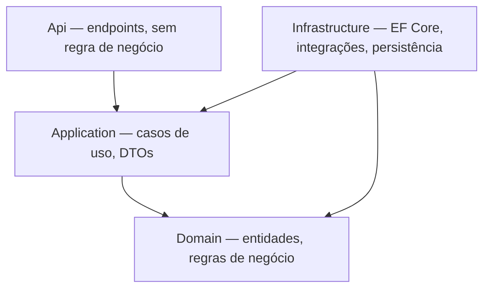
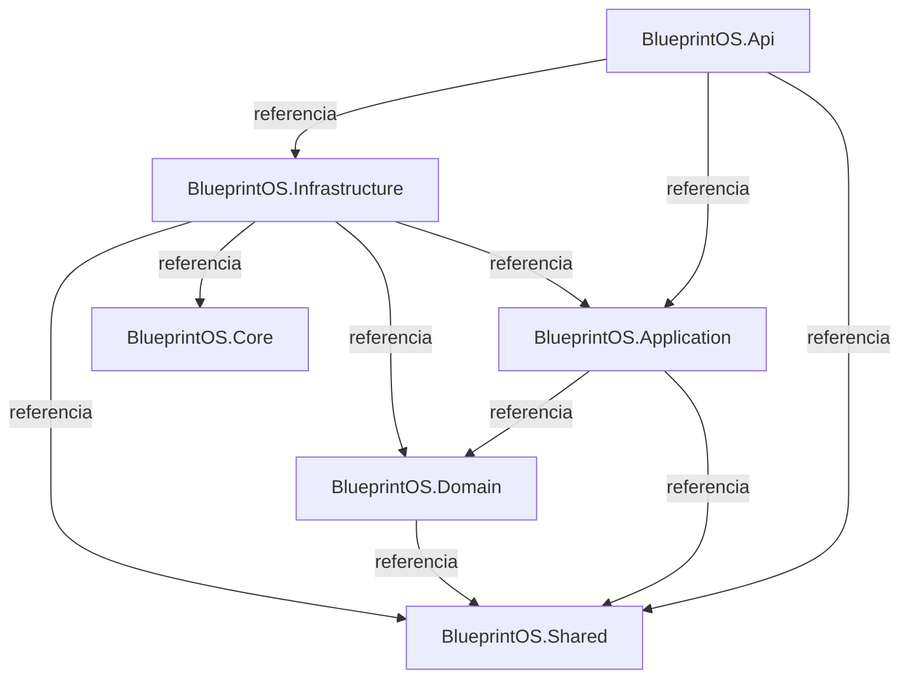

# Arquitetura

O BlueprintOS segue **Modular Monolith + Clean Architecture + DDD pragmático** (ADR-0001, ver [Decisions.md](./Decisions.md)).

Regras principais:

- Módulos se comunicam apenas via Contracts — nunca acessando `Infrastructure`, repositórios ou entidades internas de outro módulo diretamente (ADR-0005).
- `Domain` não referencia nenhuma outra camada.
- Nenhuma regra de negócio em `Api` ou `Infrastructure`.

A estrutura alvo descrita em [`.ai/ARCHITECTURE.md`](../../.ai/ARCHITECTURE.md) (`/src/Apps`, `/src/BuildingBlocks`, `/src/Modules`) ainda não foi adotada fisicamente (ADR-0006). O layout real atual é organizado por camada, não por módulo:

| Projeto | Camada |
|---|---|
| `BlueprintOS.Domain` | Domain |
| `BlueprintOS.Application` | Application |
| `BlueprintOS.Infrastructure` | Infrastructure |
| `BlueprintOS.Api` | Api (host ASP.NET Core) |
| `BlueprintOS.Core` | Contratos e modelos dos módulos já implementados (AI, Agents, Documentation, Knowledge, Publication, Workflows) |
| `BlueprintOS.Shared` | Utilitários e tipos compartilhados (ver [Shared.md](../backend/shared/Shared.md)) |

Dentro de `Core`/`Infrastructure`, cada módulo segue `{Módulo}/{Contracts,Models}` (Core) e `{Módulo}/...` (Infrastructure).

## Diagrama de dependências entre projetos

Representação mantida manualmente das referências `ProjectReference` entre os `.csproj` do backend; atualizar quando essas referências mudarem. Fonte editável em [`docs/assets/dependencies.mmd`](../assets/dependencies.mmd).

## Módulos implementados

Módulos internos de plataforma (não são domínios de negócio do +Compras, mas sustentam o próprio BlueprintOS):

### Documentation

Gerencia a documentação viva do próprio BlueprintOS: entradas de documento, versionamento, changelog, ADRs e geração de documentação técnica/funcional/IA/desenvolvedor.

- Contratos: `IDocumentationRepository`, `IDocumentVersioningService`, `IChangeLogService`, `IAdrService`, `ITechnicalDocumentationGenerator`, `IMermaidDiagramGenerator`, `IDocumentationSyncService`, `IStaleDocumentationDetector`, `IGitLogReader`.
- Classes: `MarkdownAdrService`, `TechnicalDocumentationGenerator`, `MermaidDiagramGenerator`, `DocumentationSyncService`.

### Knowledge

Ingestão e recuperação de conhecimento organizacional a partir de conteúdo Markdown.

- Contratos: `IKnowledgeProvider`, `IKnowledgeService`.
- Classes: `MarkdownKnowledgeProvider`, `KnowledgeService`.

### Agents

Ver [docs/agents/Agents.md](../agents/Agents.md) para o runtime de agentes de IA.

### AI.Negotiation

Memória de negociação e motor de estratégia baseado em regras; ainda sem agente Buyer sênior concreto. Ver [docs/backend/orchestration/Orchestration.md](../backend/orchestration/Orchestration.md) para como o backend orquestra este módulo hoje.

- Contratos: `INegotiationMemory`, `INegotiationMemoryStore`, `INegotiationStrategy`, `INegotiationStrategyRule`.
- Classes: `NegotiationMemory`, `InMemoryNegotiationMemoryStore`, `NegotiationStrategy`.

## Domínios de negócio

Ver os documentos por domínio em `docs/backend/`: [Procurement](../backend/procurement/Procurement.md), [Integration](../backend/integration/Integration.md), [Shared](../backend/shared/Shared.md). Autenticação/identidade corporativa (Microsoft Entra ID) permanece planejada — nenhum documento técnico foi criado para ela ainda, pois não há implementação real a descrever.

Para a versão vigente destas informações no código, ver `.ai/ARCHITECTURE.md`; para o estado operacional comprovado (o que já foi entregue e validado), ver `.ai/PROJECT_STATE.md` — este documento não reproduz esse estado, apenas a arquitetura permanente.
