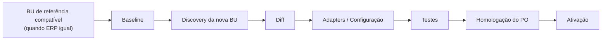

# FactoryBU.New — Processo Governado de Onboarding de Nova Business Unit

Nome conceitual provisório (não precisa ser o nome final de uma classe real). Representa um **processo
governado**, não um framework de código pronto — este documento registra o contrato arquitetural mínimo
para que decisões de hoje não bloqueiem essa evolução; a implementação completa é escopo do Encerramento do
Projeto (ver `applications/mais-compras/docs/cadernos/Encerramento-Projeto.md`).

> **Encerramento formal da Onda 2 (04/09/2026).** Este documento foi revisado no encerramento documental da
> Onda 2 (commit `d8dac6ed82aa0cfaa2222b4c56b6288fbc241a77`, `origin/main`) para refletir o estado final das
> pré-condições arquiteturais que uma execução real de `FactoryBU.New` (segunda BU) vai encontrar — ver seção
> "Pré-condições para a primeira execução real" abaixo, que substitui/atualiza a seção anterior sobre gaps
> bloqueadores. Detalhe técnico completo em
> `applications/mais-compras/docs/cadernos/Onda-2.md`.

## Por que isso existe

Grupo Soma é hoje a única Unidade de Negócio operacional do +Compras, e Linx o único ERP integrado. O código
atual — necessariamente — foi escrito e validado só contra essa combinação. O risco arquitetural é que
particularidades da Grupo Soma/Linx (nomes de tabela, triggers, regras de código legado, decisões de UX já
homologadas) sejam silenciosamente tratadas como regra universal do +Compras. `FactoryBU.New` é o contrato
que formaliza o oposto: **Grupo Soma é a primeira implementação de referência, não o molde**.

## Fluxo conceitual

`FactoryBU.New("Reserva")` (exemplo ilustrativo, não uma API real ainda):

1. **Baseline.** Se a nova BU usa o **mesmo ERP** de uma BU já implementada (ex.: Reserva + Linx, mesmo ERP
   da Grupo Soma), essa BU de referência pode servir de ponto de partida de conhecimento — nunca de cópia
   cega. Se o ERP for **diferente** (ex.: Hering + SAP), não há baseline de adapter reaproveitável: o
   processo parte diretamente dos contratos canônicos do +Compras (camada A de
   `MultiBU-MultiErp-Arquitetura.md`) e descobre, do zero, como aquele ERP fornece cada conceito.
2. **Discovery da nova BU.** Levantamento real (nunca hipotético) de tabelas, schemas, chaves, status,
   timestamps, particularidades e volume de dados do ERP daquela BU — mesmo processo já usado nos discoveries
   reais de Fornecedor/CNPJ e Item Fiscal desta aplicação (ver `docs/audits/Discovery-*`), generalizado para
   qualquer BU/ERP.
3. **Diff.** Comparação explícita entre o que a baseline (se existir) assumia e o que o discovery real da
   nova BU encontrou — toda divergência é um achado documentado, nunca uma correção silenciosa por
   suposição.
4. **Adapters / Configuração.** Implementação (ou reaproveitamento, quando o ERP é o mesmo) dos adapters de
   leitura (camada B) e da `ConfiguracaoErp` da nova BU (camada C) — servidor, banco, credenciais seguindo a
   mesma política de segredo já em vigor (`agents/EXECUTION_POLICY.md`, seção "Credenciais e Conexões").
5. **Testes.** Mesma disciplina de testes determinísticos já praticada no projeto (unitários + integração
   real opt-in, nunca em CI, mesmo padrão de `B29_REAL_WRITE_TESTS`) — cobrindo especificamente isolamento
   entre a nova BU e as já existentes (nenhum dado de uma aparece na outra).
6. **Homologação do Product Owner.** Nenhuma BU nova é ativada sem homologação explícita — mesmo padrão já
   em uso nos Gates desta aplicação (Gate Fornecedores, Gate B3 por bloco).
7. **Ativação.** A BU passa a operar; seu `Profile` (camada C) é o único lugar onde particularidades
   daquela BU específica vivem — nunca vazando para as camadas A/B.

## O que este documento NÃO é

- Não é uma API ou classe `FactoryBUNew` implementada — nenhum código foi criado por esta rodada.
- Não é permissão para generalizar prematuramente: nenhuma abstração de "segunda BU" deve ser construída
  sem uma segunda BU real para validar contra ela (mesmo princípio de "não codar para hipótese" já em vigor
  neste projeto).
- Não substitui o Guia de Implantação operacional completo (`Encerramento-Projeto.md`), que só pode ser
  escrito com evidência de pelo menos um onboarding real.

## Decisões atuais que preservam este caminho (não bloqueiam a Factory futura)

- Contratos canônicos (camada A) já são independentes de ERP por construção (Clean Architecture, ADR-0001).
- `ConfiguracaoErp`/`UnidadeNegocio` (O1.11, ADR-0022) já modelam BU e ERP como conceitos configuráveis, não
  hardcoded.
- `Usuario.Email` permanece único globalmente (pessoa, não BU) — uma nova BU não duplica usuários existentes;
  hoje o modelo é single-BU-por-usuário, então a nova BU simplesmente ganha seus próprios usuários. O modelo
  conceitual de N autorizações de BU por usuário é evolução futura, não uma pré-condição desta Factory (ver
  `MultiBU-MultiErp-Arquitetura.md`, seção "Usuário é global").

## Pré-condições para a primeira execução real (estado final da Onda 2)

No início da Onda 2, dois gaps arquiteturais (Fornecedor/CNPJ por BU, `DatasetLoadState`/
`IntegrationOccurrence` sem dimensão de BU) eram classificados como bloqueadores de uma segunda BU real. Ao
final da mesma Onda 2, ambos foram **decididos e implementados** (migrations aplicadas e validadas em
`MAISCOMPRAS Development` — ver `MultiBU-MultiErp-Arquitetura.md`, seção "Gaps — estado final da Onda 2", e
`Onda-2.md`). O que permanece como pré-condição real para a **primeira execução operacional** de
`FactoryBU.New` sobre um dataset Linx já existente (passo 2, Discovery, em diante) é mais estreito que antes:

1. **`IDatasetLoadGate`/`ToolGateway` (LiveRead governado) ainda não é Multi-BU-aware.** Precisa ser tratado
   antes que a nova BU execute o mesmo dataset por esse caminho governado.
2. **`RawLinxFornecedorSnapshotExecucao` ainda sem `UnidadeNegocioId`.** Precisa ser tratado antes do
   onboarding operacional de uma segunda BU no mesmo dataset — a resolução de "execução Full mais recente"
   usada como baseline hoje não filtra por BU.
3. **`ConfiguracaoErp` existe por BU, mas os `Soma*Readers` reais ainda não a consomem.** Só é bloqueador para
   o passo 4 (Adapters/Configuração) quando a nova BU exigir uma configuração de conexão *diferente* da atual
   (ex.: mesmo ERP Linx, banco/credenciais distintos) ou um ERP novo (ex.: SAP) — não é bloqueador para um
   cenário hipotético em que a nova BU reaproveitasse a mesma conexão física já hardcoded hoje (o que, em si,
   já seria uma violação do princípio desta Factory e não deveria ser feito).

Nenhum dos 3 pontos acima bloqueia o fechamento da Onda 2 — são pré-condições específicas para quando uma
segunda BU real de fato existir, não antes disso. Detalhe técnico completo de cada um em
`MultiBU-MultiErp-Arquitetura.md`, seção "Gaps residuais da Onda 2 (não bloqueadores)", e em `Onda-2.md`.

## Ver também

- `MultiBU-MultiErp-Arquitetura.md` — as três camadas conceituais que este processo instancia, e o detalhe
  completo das pré-condições/GAPs citados acima.
- `applications/mais-compras/docs/cadernos/Onda-2.md` — registro cronológico e técnico completo do
  encerramento da Onda 2, incluindo a implementação dos gaps que deixaram de bloquear esta Factory.
- `applications/mais-compras/docs/cadernos/Encerramento-Projeto.md` — registro formal desta entrada e do
  Guia de Implantação futuro.
- `CadFormFactory.md` — processo análogo já em uso para cadastros individuais (Fornecedores), referência de
  estilo/disciplina para esta Factory em escopo maior (BU/ERP inteiros).
