# Arquitetura Multi-BU / Multi-ERP

Contrato arquitetural formalizado na rodada Onda 2 (03/09/2026). Não substitui ADR-0022 (escopo
administrativo Produto × BU) — estende o mesmo princípio do eixo administrativo/RBAC para o eixo de dados
operacionais/integrados do +Compras. Ver também `FactoryBU-New.md` (onboarding de nova BU) e
`applications/mais-compras/docs/cadernos/Onda-2.md` (registro das decisões desta rodada).

> **Encerramento formal da Onda 2 (04/09/2026).** Este documento foi revisado e consolidado no encerramento
> documental da Onda 2 para refletir o **estado final** aprovado e commitado em `d8dac6ed82aa0cfaa2222b4c56b6288fbc241a77`
> ("feat: complete Onda 2 B3 integration and multi-BU foundation", `origin/main`). Onde este documento
> registra a evolução de uma decisão (proposta → decisão do PO → implementação), o texto abaixo deixa
> explícito qual trecho é histórico e qual é o estado final vigente. Detalhe cronológico completo e evidência
> técnica (migrations, testes, validação real em `MAISCOMPRAS Development`) estão em
> `applications/mais-compras/docs/cadernos/Onda-2.md`, entrada "ENCERRAMENTO FORMAL DA ONDA 2" — este
> documento não duplica esse detalhe, apenas referencia.

## Princípio central

> Toda Unidade de Negócio é fronteira de dados **e de segurança**. Todo dado funcional do +Compras —
> integrado do ERP ou metadado local — pertence a exatamente uma Unidade de Negócio, quando aplicável. Nada
> é global só porque hoje só existe uma BU operacional (Grupo Soma). Isolamento entre BUs (nunca vazar
> existência ou dado de uma BU para outra) é tratado como requisito de segurança, não apenas de organização
> de dados — mesmo tratamento dado ao isolamento cross-BU já em vigor no eixo administrativo
> (`EscopoAdministrativoUnidadeNegocio`, ADR-0022) e estendido nesta Onda ao eixo de dados
> operacionais/integrados (ver "Fornecedores" e "Gaps — estado final da Onda 2" abaixo).

Este princípio já está parcialmente implementado desde a Onda 1 (O1.11: `UnidadeNegocio`, `ConfiguracaoErp`
por BU; ADR-0022: `EscopoAdministrativoUnidadeNegocio` para o eixo administrativo/RBAC). O que esta rodada
formaliza é a extensão do mesmo princípio ao eixo de dados operacionais e integrados (Fornecedores, Itens
Fiscais, RAW/REFINED, datasets ERP) — hoje parcialmente sem essa dimensão, conforme auditoria registrada em
`Onda-2.md`.

## Três camadas conceituais (separação obrigatória)

```mermaid
flowchart LR
    subgraph Canon["A. Contratos Canônicos +Compras"]
        Fornecedor
        Filial
        CentroCusto
        ContaContabil
        UnidadeMedida
        ItemFiscal
        FornecedorDominio
    end
    subgraph Adapter["B. ERP Adapter / Capabilities"]
        Linx["Linx (implementado)"]
        SAP["SAP (futuro)"]
        OutroErp["outro ERP (futuro)"]
    end
    subgraph Profile["C. Business Unit Profile"]
        GrupoSoma["Grupo Soma (referência)"]
        Reserva["Reserva (futuro)"]
        Hering["Hering (futuro)"]
    end

    Profile -->|"usa"| Adapter
    Adapter -->|"normaliza para"| Canon
```



### A. Contratos canônicos +Compras

O +Compras conhece conceitos de negócio (`Fornecedor`, `Filial`, `CentroCusto`, `ContaContabil`,
`UnidadeMedida`, `ItemFiscal`, `FornecedorDominio` etc.) independentemente de qual ERP os alimenta. Este
código já existe e é o que está em `BlueprintOS.Domain`/`BlueprintOS.Application` hoje.

### B. ERP Adapter / Capabilities

Camada que conhece tabelas, APIs, schemas, watermarks, chaves, regras técnicas de leitura, particularidades
de um ERP específico, e sabe normalizar esse conhecimento para os contratos canônicos. Hoje só existe o
adapter Linx (`BlueprintOS.Infrastructure/Integrations/ERP/Soma/*`, ex.: `SomaFornecedorReader`,
`SomaItemFiscalReader`). Um adapter SAP (ou outro) futuro implementaria os mesmos contratos de leitura
(`IFornecedorErpReader`, `IItemFiscalErpReader` etc.) sem alterar a camada A.

### C. Business Unit Profile

Conhecimento/configuração específica de uma BU: qual ERP ela usa, configuração de conexão daquele ERP,
datasets habilitados, particularidades homologadas, mapeamentos excepcionais, capacidades disponíveis. Hoje
representado por `UnidadeNegocio` + `ConfiguracaoErp` (Domain/Identity). Grupo Soma é a primeira instância
real desta camada — **implementação de referência, não regra universal**: nenhuma particularidade da Grupo
Soma (ex.: nome de tabela Linx, trigger de sanitização, regra de código legado alfanumérico) deve ser
promovida para a camada A ou B sem evidência de que outra BU/ERP também a exige.

## Regra de execução headless (pipelines/datasets)

Toda execução de pipeline ERP é conceitualmente:

```text
BusinessUnit + Dataset + ERP Configuration + Execution Mode
```

Exemplo: `BusinessUnit=Grupo Soma, Dataset=linx.itens-fiscais.snapshot, ERP=Linx, Mode=FULL`.

- A `BusinessUnit` da execução é **sempre recebida explicitamente** por quem dispara o pipeline (job,
  execução agendada, chamada administrativa) — nunca inferida de `ICurrentIdentity`/sessão de usuário. Um
  pipeline headless não tem usuário logado; inferir BU do usuário seria um dado inventado, não um dado
  vindo do contexto real da execução.
- Se uma execução não tiver uma `BusinessUnit` válida/configurada, o pipeline deve **falhar fechado antes de
  ler ou escrever qualquer dado de domínio**.
- A resolução de `ConfiguracaoErp` (servidor/banco/credenciais) usada pela execução vem sempre da
  `BusinessUnit` recebida, nunca hardcoded.
- Identidade de estado de dataset (`DatasetLoadState`/watermark/baseline) e de ocorrência de integração
  (`IntegrationOccurrence`) deve contemplar `BusinessUnitId + Dataset` (e, quando aplicável,
  `BusinessUnitId + Dataset + ExecutionId`) — duas BUs executando o mesmo nome de dataset nunca podem
  colidir de estado.

**Estado inicial auditado nesta rodada** (auditoria read-only, histórico): o pipeline `ItemFiscal`
(`ProcessarItensFiscaisRawParaDominioUseCase`) já seguia a primeira parte da regra corretamente — nunca criava
`ItemFiscal` novo sem uma `UnidadeNegocioId` resolvível, preferindo registrar uma ocorrência `Warning` a
inferir/hardcodear o valor — mas ainda não recebia `BusinessUnit` explícita da execução para então criar de
fato.

**Estado final da Onda 2 (implementado, 03/09/2026):** a segunda parte foi implementada na mesma rodada.
`ItensFiscaisRefinedCliHandler` passa a exigir `--business-unit <slug>`, resolve contra `UnidadeNegocio` real
e falha fechado (`BUSINESS_UNIT_REQUIRED`/`BUSINESS_UNIT_NOT_FOUND`/`BUSINESS_UNIT_INATIVA`, exit code 1)
antes de instanciar o use case; `ProcessarItensFiscaisRawParaDominioUseCase.ExecutarAsync` recebe
`Guid unidadeNegocioId` obrigatório (defesa em profundidade, `ArgumentException` se `Guid.Empty`). Este é o
padrão de referência a replicar nos demais pipelines headless. Ver `Onda-2.md`, entrada "Integrações headless
recebem BusinessUnit explicitamente, nunca inferida do usuário".

`DatasetLoadState`/`IntegrationOccurrence` — auditados nesta rodada sem dimensão de BU (colidiriam entre duas
BUs reais) — tiveram a dimensão de BU **implementada** nesta mesma rodada para `IntegrationOccurrence` e para
`LinxDatasetLoadState` nos 3 pipelines REFINED que os consomem diretamente. Dois GAPs residuais bem
delimitados permanecem, classificados como dívida não bloqueadora com gatilho explícito — ver "Gaps
residuais da Onda 2 (não bloqueadores)" abaixo.

## Padrão ERP → RAW → REFINED → DOMAIN (padrão arquitetural recomendado)

Quando aplicável, o padrão arquitetural recomendado do BlueprintOS para um novo pipeline de aquisição de ERP é:

```text
ERP → aquisição mínima governada → RAW → REFINED → domínio +Compras → reconciliação
```

Princípios:

- Sair rapidamente do ERP: minimizar round-trips, evitar N+1, evitar processamento pesado dentro do próprio ERP,
  selecionar somente as colunas necessárias à capability.
- Preferir operações set-based, em lote (batch) ou streaming conforme o volume e a capability disponível — nunca
  processar registro a registro quando existir alternativa em lote.
- Processamento pesado (transformação, regra de negócio, deduplicação) acontece no +Compras, nunca no ERP.
- Toda aquisição é idempotente e reprocessável: reexecutar a mesma janela/dataset produz o mesmo resultado, sem
  duplicar nem perder dado.
- Reconciliação e auditoria são parte do padrão, não um extra opcional: toda carga deixa evidência (execução,
  contagem, ocorrência) que permite provar o que foi lido e o que foi feito com o que foi lido.
- RAW não significa copiar indiscriminadamente o ERP inteiro. A estratégia de persistência RAW (o que persistir,
  por quanto tempo, com que granularidade) deve considerar volume, necessidade de auditoria, capacidade de
  recuperação/reprocessamento e custo de armazenamento — um dataset pequeno pode adotar uma estratégia mais
  simples/proporcional (ex.: FULL sem máquina de baseline por posição, como `linx.unidades-medida.snapshot`) sem
  violar o padrão.

Este padrão foi seguido e comprovado nesta rodada pelos datasets de cadastro de apoio (Contas Contábeis, Unidades
de Medida, Centros de Custo, Filiais, Itens Fiscais, Item Fiscal Referência por Fornecedor, Fornecedor Domínios)
implementados ponta a ponta via `LiveRead → RAW → REFINED → domínio → reconciliação` (ver
`agents/linx-database-specialist-agent/agent.yaml`, achados `B3-BLOCO5A-CADASTROS-APOIO-PREPARACAO` e
`B3-BLOCO5A-PREPARACAO-CONCLUIDA`, e `applications/mais-compras/docs/cadernos/Onda-2.md`).

## Proteção do ERP (princípios permanentes de aquisição)

Qualquer capability que acesse o ERP (Linx hoje, outro ERP no futuro) deve, por princípio permanente:

- Evitar transações longas contra o ERP.
- Evitar N+1 (uma consulta por registro) — preferir leitura em lote/streaming.
- Evitar `SELECT *` — selecionar somente as colunas necessárias à capability.
- Evitar scans e round-trips desnecessários.
- Escolher o nível de isolamento de leitura de forma consciente e documentada, nunca por padrão implícito do driver.
- Manter processamento pesado (regra de negócio, transformação, deduplicação) fora do ERP, sempre no +Compras.
- Nunca alterar estrutura do ERP (schema, índice, procedure) sem autorização explícita de DBA/arquiteto responsável
  pelo ambiente Linx.

**Importante — isto não é uma regra universal de NOLOCK.** O adapter atual (`SomaLinxDatasetBulkReader`) usa
`READ UNCOMMITTED` na conexão de origem como decisão específica e evidenciada para o caso de uso atual (leitura em
massa, não-mutante, de dataset pré-registrado sob `GovernedExecutionMode.LiveRead`) — isto não deve ser lido como
recomendação genérica de `NOLOCK`/`READ UNCOMMITTED` para qualquer leitura futura do ERP. Cada novo
adapter/capability deve escolher e justificar seu próprio nível de isolamento.

## Fornecedores — CNPJ como fronteira de BU

**Histórico (estado auditado no início desta rodada):** a regra "1 CNPJ/CPF = 1 Fornecedor" deveria valer
**dentro** da Business Unit, não corporativamente entre BUs diferentes — decisão desta rodada. O estado real
do código, porém, implementava deliberadamente o oposto: `Fornecedor.Cnpj_Cpf` tinha índice único **global**
(`FornecedorConfiguration.cs`), com comentário explícito no código justificando essa escolha ("Fornecedor é
corporativo, não pertence a um usuário") e descartando `BusinessUnit` "por ausência de evidência de
necessidade" no momento em que foi escrito. `FornecedorLinxVinculo` (vínculo com o ERP) também não carregava
`UnidadeNegocioId` — sua identidade era `ErpSistema + CodigoErp`. Isso era uma mudança de regra funcional já
implementada e homologada (Gate Fornecedores aprovado pelo Product Owner em 01/09/2026), não um gap de
omissão — alterá-la exigia decisão explícita do Product Owner antes de qualquer migration, por envolver
trocar um índice único físico já em produção/homologação.

**Estado final da Onda 2 (implementado, 04/09/2026):** o Product Owner decidiu, na mesma rodada, migrar para
`(UnidadeNegocioId, Cnpj_Cpf)` — 1 CNPJ/CPF = 1 Fornecedor **dentro** da BU; `Grupo Soma/CNPJ X` e
`Reserva/CNPJ X` (hipotético) podem existir como Fornecedores independentes, sem compartilhamento automático
de dado entre BUs. Implementado de ponta a ponta: `Fornecedor.UnidadeNegocioId` e
`FornecedorLinxVinculo.UnidadeNegocioId` (Domain, imutáveis, fail-closed); índices únicos compostos
`(UnidadeNegocioId, Cnpj_Cpf)`, `(UnidadeNegocioId, ErpSistema, ErpFornecedorId)` e
`(UnidadeNegocioId, ErpSistema, CodigoErp)`; todos os repositórios e pipelines headless passam a exigir
`unidadeNegocioId` explícito e fail-closed (mesmo padrão do Item Fiscal). Migration
`NormalizarFornecedorPorUnidadeNegocioOnda2` aplicada com sucesso em `MAISCOMPRAS Development` (backfill
100% correto, zero perda de dado, 73.449 Fornecedores / 76.419 vínculos preservados). Isso é normalização
arquitetural para Multi-BU, **não reabertura funcional** do cadastro Grupo Soma — o Gate de Fornecedores já
homologado (01/09/2026) permanece válido, sem regressão. Detalhe técnico completo, evidência de testes e
migration em `Onda-2.md`, entrada "GAP — Fornecedor/CNPJ: unicidade global vs. fronteira de BU".

## Configuração ERP administrável — o que já existe (reaproveitar, não recriar)

Auditoria read-only desta rodada confirmou uma fundação sólida e reutilizável, entregue na O1.11 e ADR-0022:

- `UnidadeNegocio` (Domain/Identity) — raiz do particionamento multi-tenant; slug imutável, sem exclusão
  física (`Ativar`/`Inativar`).
- `ConfiguracaoErp` (Domain/Identity) — relação 1:1 com `UnidadeNegocio` (índice único em `UnidadeNegocioId`);
  `SistemaErp` (nome do ERP) + `ParametrosConexaoProtegidos` (string cifrada) + `Status`. Upsert idempotente
  via `SalvarConfiguracaoErpUseCase` (não há criar/editar separados). Editar com parâmetro de segredo nulo
  **preserva** o segredo já salvo — nunca sobrescreve com vazio.
- Segredo nunca em claro: `ISegredoProtector`/`IConfiguracaoErpSegredoProtector`, implementado sobre
  `Microsoft.AspNetCore.DataProtection` com **propósito de cifragem dedicado**
  (`"BlueprintOS.ConfiguracaoErp.ParametrosConexao.v1"`, distinto do propósito usado por `IdentityProvider` —
  DEB-16 já corrigida). API nunca devolve o valor em claro, só `ParametrosConfigurados: bool`.
- Permissão `ConfiguracaoErp.Gerenciar` já existe, classificada **PRODUTO** pela ADR-0022 — reservada ao
  Administrador Sênior, nunca concedida a Perfis de BU (`CatalogoInicialPerfisDeNegocioUseCase`).
- `CriarUnidadeNegocioUseCase` já dispara automaticamente, na mesma transação, o catálogo inicial de Perfis
  de negócio (`CatalogoInicialPerfisDeNegocioUseCase.GarantirCatalogoAsync`) para toda BU nova — é,
  na prática, o embrião já existente de `FactoryBU.New` para o eixo administrativo/RBAC (ver
  `FactoryBU-New.md`).
- `EscopoAdministrativoUnidadeNegocio`/`EscopoUnidadeNegocioPathFilter` é a abstração central e única de
  isolamento cross-BU no eixo administrativo — nenhum controller reimplementa a regra; 5 controllers usam o
  filter diretamente (Alçadas, Regras de Workflow, Regras Orçamentárias, Identity Providers, Configuração de
  Notificações), 2 (`ConfiguracaoErp`, `UnidadeNegocio`) são protegidos apenas pela permissão PRODUTO (sem
  filter, por serem recursos corporativos por definição), e o restante resolve a BU da própria sessão.

**Gap real (não resolvido por esta rodada, estado final da Onda 2):** nenhum leitor ERP real
(`SomaFornecedorReader`, `SomaItemFiscalReader`, `SomaFilialReader` etc.) consome `ConfiguracaoErp` hoje —
cada um resolve sua própria conexão por outro mecanismo. `ConfiguracaoErp` é, até esta data, um cadastro
administrativo correto mas sem efeito real sobre qual banco/ERP um pipeline de fato lê. **Classificação:**
dívida arquitetural reconhecida, explicitamente **não bloqueadora** do fechamento da Onda 2 e **sem prazo**
atrelado a esse fechamento — decisão confirmada pelo Product Owner (evoluir a estrutura existente quando
necessário, nunca criar uma segunda arquitetura de configuração ERP paralela). **Tratar em:** quando existir
necessidade real de configurar um segundo ERP/BU (ex.: hipoteticamente, uma segunda BU no mesmo Linx com
outra configuração, ou um ERP diferente como SAP) — wiring completo é pré-requisito para uma segunda BU/ERP
real funcionar de ponta a ponta, mas não é urgente enquanto só existe Grupo Soma/Linx. Ver GAP formal em
`Onda-2.md`, entrada "GAP — `ConfiguracaoErp` (O1.11) ainda não é consumida pelos leitores ERP reais".

**Limitação a considerar na evolução:** `ParametrosConexaoProtegidos` é uma string opaca genérica (não um
modelo estruturado com servidor/porta/banco/usuário como campos próprios). Se a evolução multi-ERP exigir
campos distintos por tipo de ERP, o padrão hoje seria serializar um JSON e cifrar o JSON inteiro — sem
infraestrutura de parsing/validação de subcampos ainda existente.

## Agents — BusinessUnit Context no fluxo, Agent ≠ LLM

O Bloco 5A.9 (`agents/linx-database-specialist-agent/agent.yaml`), concluído dentro desta mesma Onda 2,
formaliza o fluxo `GovernedExecutionMode.LiveRead` como modo novo e distinto de `LiveExecution` (nunca uma
variação da escrita), `IReadExecutionAdapter` resolvendo `ActionProposal.Resource` contra um catálogo de
datasets pré-registrado e revisado em código (nunca SQL fornecido pelo chamador), streaming direto
`SqlDataReader → SqlBulkCopy` sem materializar em memória, e **zero chamada a `IAIRuntime` no caminho feliz**,
comprovado por teste dedicado com um `IAIRuntime` fake que lança exceção se for chamado. `ToolGateway` aplica
a regra nos dois sentidos (um adapter só-leitura não executa por `LiveExecution`, um adapter só-escrita não
executa por `LiveRead`). Este é o mecanismo real que sustenta "Agent ≠ LLM" e "happy path zero LLM" no fluxo
`Orchestrator → BusinessUnit Context → ERP Agent → Capability determinística → RAW → REFINED → Domain Agent`
desta rodada, e foi exercitado com execução real contra `SOMA_DESENV` na bateria final de certificação B3
(ver `Onda-2.md`).

**GAP não bloqueador — este caminho ainda não é Multi-BU-aware.** `LinxDatasetLoadStateGate` (que implementa
`IDatasetLoadGate`, consumido por `LinxDatasetSnapshotReadAdapter`) não propaga `UnidadeNegocioId` até o
motor de Governança de IA (`ToolGateway`/`ActionProposal`) — decisão deliberada de não tocar
`BlueprintOS.Core.AI.Governance` nesta rodada, por ser o subsistema de maior criticidade de segurança do
projeto (hash de payload para prevenção de reuso de aprovação, suíte de testes adversariais própria).
**Classificação:** dívida reconhecida, não bloqueadora do fechamento da Onda 2 (hoje seguro, só existe Grupo
Soma). **Tratar em:** antes de uma segunda BU real executar o mesmo dataset (`linx.fornecedores.snapshot` ou
outro) por esse caminho `LiveRead` governado. Detalhe completo em `Onda-2.md`, seção "Gaps residuais da
Onda 2 (não bloqueadores)", item 1.

## Gaps — estado final da Onda 2

Os 5 pontos abaixo foram identificados durante a auditoria read-only do início desta rodada como "Gaps
abertos, exigem decisão do Product Owner antes de implementação". Ao final da mesma Onda 2, 3 deles foram
decididos e implementados, 1 foi parcialmente implementado (com 2 GAPs residuais bem delimitados) e 1
permanece aberto por decisão deliberada de escopo. Nenhum dos 5 bloqueia o fechamento da Onda 2.

1. **Fornecedor/CNPJ por BU vs. global.** ~~Requer decisão explícita antes de qualquer alteração de
   índice/migration.~~ **Implementado (04/09/2026).** Ver seção "Fornecedores — CNPJ como fronteira de BU"
   acima.
2. **`DatasetLoadState`/`IntegrationOccurrence` sem dimensão de BU.** **Implementado (04/09/2026)** para
   `IntegrationOccurrence` e para `LinxDatasetLoadState` nos 3 pipelines REFINED que os consomem diretamente
   via `DbContext` (Item Fiscal, Cadastro de Apoio genérico, Fornecedor). Permanecem 2 GAPs residuais, não
   bloqueadores, com gatilho explícito — ver "Gaps residuais da Onda 2 (não bloqueadores)" abaixo (itens 1 e
   2).
3. **`ItemFiscal.CriarDeErp` a partir do pipeline headless.** **Implementado (03/09/2026).** Ver seção
   "Regra de execução headless" acima.
4. **`FilialMetadado` com índice único por BU, divergente dos outros 3 metadados de cadastro de apoio.**
   **Implementado (03/09/2026).** Decisão do Product Owner: alinhar os 3 (`ContaContabilMetadado`/
   `UnidadeMedidaMetadado`/`CentroCustoMetadado`) ao modelo de `FilialMetadado` — os 4 passam a ter índice
   único composto `(UnidadeNegocioId, CodigoErp)`. Comportamento lazy de criação de metadado (nunca criar em
   massa) preservado sem alteração. Detalhe em `Onda-2.md`, entrada "GAP — padronização dos 4 metadados de
   cadastro de apoio por `UnidadeNegocioId + CodigoErp`".
5. **`ConfiguracaoErp` não é consumida por nenhum leitor ERP real.** **Permanece aberto** — dívida
   arquitetural reconhecida, não bloqueadora, sem prazo atrelado ao fechamento da Onda 2. Ver seção
   "Configuração ERP administrável" acima e item 3 de "Gaps residuais da Onda 2 (não bloqueadores)" abaixo.

## Usuário é global — Business Unit é atributo de sessão, não de identidade

`Usuario.Email` permanece único **globalmente** — a identidade da pessoa é única no +Compras, não por BU
(decisão de produto já existente, confirmada nesta rodada, não uma mudança). Isso é deliberadamente diferente
do restante do princípio "BU é fronteira de dados": o **usuário como pessoa** não pertence a uma BU do mesmo
jeito que um Fornecedor ou um Item Fiscal pertencem — ele **acessa** uma ou mais BUs.

**Estado atual (implementado):** o modelo hoje é single-BU-por-usuário — `Usuario.UnidadeNegocioId` único,
claim de sessão única. Cada usuário pertence a exatamente uma BU.

**Modelo conceitual formalizado para evolução futura (NÃO implementado nesta rodada, apenas registrado como
direção):** Usuário global × N autorizações de Business Unit × uma Business Unit ativa na sessão. Ou seja:
uma pessoa poderia, no futuro, ter autorização para acessar mais de uma BU (ex.: um usuário corporativo que
atende Grupo Soma e uma futura BU), escolher qual BU está ativa na sessão corrente, e todo dado permanecer
isolado pela BU ativa — nunca vazamento entre BUs, e nunca duplicação do `Usuario` (um registro por BU) só
para representar a mesma pessoa em duas BUs. Este modelo não tem implementação, migration ou schema
associado nesta rodada — é a direção conceitual que evita que uma implementação futura precipitada
("simplesmente duplicar `Usuario` por BU") seja confundida com a evolução correta.

**Tratar em:** próxima onda ou Encerramento do Projeto — só se torna necessário com uma segunda BU real e
usuários reais compartilhados entre BUs. Não é um bloqueio para o fechamento da Onda 2. Detalhe em
`Onda-2.md`, entrada "`Usuario.Email` permanece único globalmente — confirmado, com evolução conceitual
futura".

## Gaps residuais da Onda 2 (não bloqueadores)

Lista consolidada dos gaps reais que permanecem abertos ao final da Onda 2. Nenhum deles impede o fechamento
desta Onda — todos têm classificação explícita de não-bloqueador e gatilho de quando devem ser tratados.
Detalhe técnico completo de cada item em `Onda-2.md`, entrada "Gaps residuais da Onda 2 (não bloqueadores)".

1. **`IDatasetLoadGate`/`ToolGateway` (LiveRead governado) ainda não é Multi-BU-aware.** Ver seção "Agents —
   BusinessUnit Context no fluxo" acima. **Tratar em:** antes de uma segunda BU real executar
   `linx.fornecedores.snapshot` (ou outro dataset) por esse caminho.
2. **`RawLinxFornecedorSnapshotExecucao` ainda sem `UnidadeNegocioId`.** A execução RAW compartilhada como
   cabeçalho pelos pipelines de Fornecedor/Item Fiscal/Cadastro de Apoio/Referências Fiscais não filtra por
   BU ao resolver a "execução Full completa mais recente" usada para baseline — seguro hoje (só existe Grupo
   Soma), mas pode selecionar a execução RAW de uma BU como candidata de outra assim que uma segunda BU rodar
   o mesmo dataset. **Tratar em:** antes do onboarding operacional de uma segunda BU no mesmo dataset — ou
   seja, antes da primeira execução real de `FactoryBU.New` sobre um dataset Linx já existente (ver
   `FactoryBU-New.md`).
3. **`ConfiguracaoErp` existe por BU (O1.11/ADR-0022), mas os `Soma*Readers` ainda não a consomem.** Ver
   seção "Configuração ERP administrável" acima. **Tratar em:** dívida arquitetural para evolução Multi-ERP,
   sem prazo atrelado ao fechamento da Onda 2 — só urgente quando existir necessidade real de um segundo
   ERP/BU a configurar.
4. **Bloco 5B (+Compras → Linx) intencionalmente não iniciado.** Depende de validação com especialista
   Visual Linx (mesma decisão do Product Owner já aplicada anteriormente à B2.9/Adapter Linx). **Não bloqueou
   o B3 nem a Onda 2** e não deve ser lido como bloqueador em nenhum outro documento. **Tratar em:** onda
   específica futura, quando a validação com o especialista estiver agendada.

## Ver também

- `FactoryBU-New.md` — processo conceitual de onboarding de nova BU (consome os GAPs acima como pré-condição
  de uma segunda BU real).
- `applications/mais-compras/docs/cadernos/Onda-2.md` — registro cronológico completo desta rodada,
  incluindo a entrada "ENCERRAMENTO FORMAL DA ONDA 2" e o detalhe técnico de cada gap/migration citado acima.
- `applications/mais-compras/docs/cadernos/Encerramento-Projeto.md` — itens que só podem ser tratados/
  validados plenamente ao final do projeto (Guia de implantação de nova BU/ERP, framework completo de
  `FactoryBU.New`).
- `.ai/DECISIONS.md`, ADR-0022 — escopo administrativo Produto × BU (fundação já implementada).
