# Arquitetura Multi-BU / Multi-ERP

Contrato arquitetural formalizado na rodada Onda 2 (03/09/2026). Não substitui ADR-0022 (escopo
administrativo Produto × BU) — estende o mesmo princípio do eixo administrativo/RBAC para o eixo de dados
operacionais/integrados do +Compras. Ver também `FactoryBU-New.md` (onboarding de nova BU) e
`applications/mais-compras/docs/cadernos/Onda-2.md` (registro das decisões desta rodada).

## Princípio central

> Toda Unidade de Negócio é fronteira de dados. Todo dado funcional do +Compras — integrado do ERP ou
> metadado local — pertence a exatamente uma Unidade de Negócio. Nada é global só porque hoje só existe uma
> BU operacional (Grupo Soma).

Este princípio já está parcialmente implementado desde a Onda 1 (O1.11: `UnidadeNegocio`, `ConfiguracaoErp`
por BU; ADR-0022: `EscopoAdministrativoUnidadeNegocio` para o eixo administrativo/RBAC). O que esta rodada
formaliza é a extensão do mesmo princípio ao eixo de dados operacionais e integrados (Fornecedores, Itens
Fiscais, RAW/REFINED, datasets ERP) — hoje parcialmente sem essa dimensão, conforme auditoria registrada em
`Onda-2.md`.

## Três camadas conceituais (separação obrigatória)

```mermaid
flowchart LR
    subgraph Canon["A. Contratos Canônicos +Compras"]
        Fornecedor
        Filial
        CentroCusto
        ContaContabil
        UnidadeMedida
        ItemFiscal
        FornecedorDominio
    end
    subgraph Adapter["B. ERP Adapter / Capabilities"]
        Linx["Linx (implementado)"]
        SAP["SAP (futuro)"]
        OutroErp["outro ERP (futuro)"]
    end
    subgraph Profile["C. Business Unit Profile"]
        GrupoSoma["Grupo Soma (referência)"]
        Reserva["Reserva (futuro)"]
        Hering["Hering (futuro)"]
    end

    Profile -->|"usa"| Adapter
    Adapter -->|"normaliza para"| Canon
```



### A. Contratos canônicos +Compras

O +Compras conhece conceitos de negócio (`Fornecedor`, `Filial`, `CentroCusto`, `ContaContabil`,
`UnidadeMedida`, `ItemFiscal`, `FornecedorDominio` etc.) independentemente de qual ERP os alimenta. Este
código já existe e é o que está em `BlueprintOS.Domain`/`BlueprintOS.Application` hoje.

### B. ERP Adapter / Capabilities

Camada que conhece tabelas, APIs, schemas, watermarks, chaves, regras técnicas de leitura, particularidades
de um ERP específico, e sabe normalizar esse conhecimento para os contratos canônicos. Hoje só existe o
adapter Linx (`BlueprintOS.Infrastructure/Integrations/ERP/Soma/*`, ex.: `SomaFornecedorReader`,
`SomaItemFiscalReader`). Um adapter SAP (ou outro) futuro implementaria os mesmos contratos de leitura
(`IFornecedorErpReader`, `IItemFiscalErpReader` etc.) sem alterar a camada A.

### C. Business Unit Profile

Conhecimento/configuração específica de uma BU: qual ERP ela usa, configuração de conexão daquele ERP,
datasets habilitados, particularidades homologadas, mapeamentos excepcionais, capacidades disponíveis. Hoje
representado por `UnidadeNegocio` + `ConfiguracaoErp` (Domain/Identity). Grupo Soma é a primeira instância
real desta camada — **implementação de referência, não regra universal**: nenhuma particularidade da Grupo
Soma (ex.: nome de tabela Linx, trigger de sanitização, regra de código legado alfanumérico) deve ser
promovida para a camada A ou B sem evidência de que outra BU/ERP também a exige.

## Regra de execução headless (pipelines/datasets)

Toda execução de pipeline ERP é conceitualmente:

```text
BusinessUnit + Dataset + ERP Configuration + Execution Mode
```

Exemplo: `BusinessUnit=Grupo Soma, Dataset=linx.itens-fiscais.snapshot, ERP=Linx, Mode=FULL`.

- A `BusinessUnit` da execução é **sempre recebida explicitamente** por quem dispara o pipeline (job,
  execução agendada, chamada administrativa) — nunca inferida de `ICurrentIdentity`/sessão de usuário. Um
  pipeline headless não tem usuário logado; inferir BU do usuário seria um dado inventado, não um dado
  vindo do contexto real da execução.
- Se uma execução não tiver uma `BusinessUnit` válida/configurada, o pipeline deve **falhar fechado antes de
  ler ou escrever qualquer dado de domínio**.
- A resolução de `ConfiguracaoErp` (servidor/banco/credenciais) usada pela execução vem sempre da
  `BusinessUnit` recebida, nunca hardcoded.
- Identidade de estado de dataset (`DatasetLoadState`/watermark/baseline) e de ocorrência de integração
  (`IntegrationOccurrence`) deve contemplar `BusinessUnitId + Dataset` (e, quando aplicável,
  `BusinessUnitId + Dataset + ExecutionId`) — duas BUs executando o mesmo nome de dataset nunca podem
  colidir de estado.

**Estado real na data desta rodada** (auditoria read-only, ver `Onda-2.md`): o pipeline `ItemFiscal`
(`ProcessarItensFiscaisRawParaDominioUseCase`) já segue a primeira parte da regra corretamente — nunca cria
`ItemFiscal` novo sem uma `UnidadeNegocioId` resolvível, preferindo registrar uma ocorrência `Warning` a
inferir/hardcodear o valor. Não implementa ainda a segunda parte (receber `BusinessUnit` explícita da
execução para então criar de fato) — GAP registrado em `Onda-2.md`, dentro do escopo do Bloco 5A em
andamento (não implementado por esta rodada, para não colidir com esse trabalho não commitado).
`DatasetLoadState`/`IntegrationOccurrence` hoje têm identidade apenas por `Dataset` (e `ExecutionId`, no caso
de `IntegrationOccurrence`), sem dimensão de BU — colidiriam entre duas BUs reais. Ver GAP formal na seção
"Gaps abertos" abaixo.

## Fornecedores — CNPJ como fronteira de BU (tensão identificada, não resolvida nesta rodada)

A regra "1 CNPJ/CPF = 1 Fornecedor" deve valer **dentro** da Business Unit, não corporativamente entre BUs
diferentes — decisão desta rodada. O estado real do código, porém, implementa deliberadamente o oposto:
`Fornecedor.Cnpj_Cpf` tem índice único **global** (`FornecedorConfiguration.cs`), com comentário explícito no
código justificando essa escolha ("Fornecedor é corporativo, não pertence a um usuário") e descartando
`BusinessUnit` "por ausência de evidência de necessidade" no momento em que foi escrito. `FornecedorLinxVinculo`
(vínculo com o ERP) também não carrega `UnidadeNegocioId` — sua identidade é `ErpSistema + CodigoErp`.

Isso é uma **mudança de regra funcional já implementada e homologada** (Gate Fornecedores aprovado pelo
Product Owner em 01/09/2026), não um gap de omissão — alterá-la exige decisão explícita do Product Owner
antes de qualquer migration, por envolver trocar um índice único físico já em produção/homologação. Ver GAP
formal na seção seguinte.

## Configuração ERP administrável — o que já existe (reaproveitar, não recriar)

Auditoria read-only desta rodada confirmou uma fundação sólida e reutilizável, entregue na O1.11 e ADR-0022:

- `UnidadeNegocio` (Domain/Identity) — raiz do particionamento multi-tenant; slug imutável, sem exclusão
  física (`Ativar`/`Inativar`).
- `ConfiguracaoErp` (Domain/Identity) — relação 1:1 com `UnidadeNegocio` (índice único em `UnidadeNegocioId`);
  `SistemaErp` (nome do ERP) + `ParametrosConexaoProtegidos` (string cifrada) + `Status`. Upsert idempotente
  via `SalvarConfiguracaoErpUseCase` (não há criar/editar separados). Editar com parâmetro de segredo nulo
  **preserva** o segredo já salvo — nunca sobrescreve com vazio.
- Segredo nunca em claro: `ISegredoProtector`/`IConfiguracaoErpSegredoProtector`, implementado sobre
  `Microsoft.AspNetCore.DataProtection` com **propósito de cifragem dedicado**
  (`"BlueprintOS.ConfiguracaoErp.ParametrosConexao.v1"`, distinto do propósito usado por `IdentityProvider` —
  DEB-16 já corrigida). API nunca devolve o valor em claro, só `ParametrosConfigurados: bool`.
- Permissão `ConfiguracaoErp.Gerenciar` já existe, classificada **PRODUTO** pela ADR-0022 — reservada ao
  Administrador Sênior, nunca concedida a Perfis de BU (`CatalogoInicialPerfisDeNegocioUseCase`).
- `CriarUnidadeNegocioUseCase` já dispara automaticamente, na mesma transação, o catálogo inicial de Perfis
  de negócio (`CatalogoInicialPerfisDeNegocioUseCase.GarantirCatalogoAsync`) para toda BU nova — é,
  na prática, o embrião já existente de `FactoryBU.New` para o eixo administrativo/RBAC (ver
  `FactoryBU-New.md`).
- `EscopoAdministrativoUnidadeNegocio`/`EscopoUnidadeNegocioPathFilter` é a abstração central e única de
  isolamento cross-BU no eixo administrativo — nenhum controller reimplementa a regra; 5 controllers usam o
  filter diretamente (Alçadas, Regras de Workflow, Regras Orçamentárias, Identity Providers, Configuração de
  Notificações), 2 (`ConfiguracaoErp`, `UnidadeNegocio`) são protegidos apenas pela permissão PRODUTO (sem
  filter, por serem recursos corporativos por definição), e o restante resolve a BU da própria sessão.

**Gap real (não resolvido por esta rodada):** nenhum leitor ERP real (`SomaFornecedorReader`,
`SomaItemFiscalReader`, `SomaFilialReader` etc.) consome `ConfiguracaoErp` hoje — cada um resolve sua própria
conexão por outro mecanismo. `ConfiguracaoErp` é, até esta data, um cadastro administrativo correto mas sem
efeito real sobre qual banco/ERP um pipeline de fato lê. Ver GAP formal em `Onda-2.md`. Wiring completo é
pré-requisito para uma segunda BU/ERP real funcionar de ponta a ponta — mas não é urgente enquanto só existe
Grupo Soma/Linx.

**Limitação a considerar na evolução:** `ParametrosConexaoProtegidos` é uma string opaca genérica (não um
modelo estruturado com servidor/porta/banco/usuário como campos próprios). Se a evolução multi-ERP exigir
campos distintos por tipo de ERP, o padrão hoje seria serializar um JSON e cifrar o JSON inteiro — sem
infraestrutura de parsing/validação de subcampos ainda existente.

## Agents — BusinessUnit Context no fluxo, Agent ≠ LLM

O trabalho paralelo em andamento nesta mesma data (Bloco 5A.9, `agents/linx-database-specialist-agent/agent.yaml`)
já formaliza exatamente o fluxo desejado pela seção 17 desta rodada: `GovernedExecutionMode.LiveRead` como
modo novo e distinto de `LiveExecution` (nunca uma variação da escrita), `IReadExecutionAdapter` resolvendo
`ActionProposal.Resource` contra um catálogo de datasets pré-registrado e revisado em código (nunca SQL
fornecido pelo chamador), streaming direto `SqlDataReader → SqlBulkCopy` sem materializar em memória, e
**zero chamada a `IAIRuntime` no caminho feliz**, comprovado por teste dedicado com um `IAIRuntime` fake que
lança exceção se for chamado. `ToolGateway` aplica a regra nos dois sentidos (um adapter só-leitura não
executa por `LiveExecution`, um adapter só-escrita não executa por `LiveRead`). Este é o mecanismo real que
sustenta "Agent ≠ LLM" e "happy path zero LLM" no fluxo `Orchestrator → BusinessUnit Context → ERP Agent →
Capability determinística → RAW → REFINED → Domain Agent" desta rodada — não implementado por esta sessão
(faz parte do Bloco 5A em progresso), apenas confirmado por leitura.

## Gaps abertos (exigem decisão do Product Owner antes de implementação)

1. **Fornecedor/CNPJ por BU vs. global.** Mudar de índice único global para `(UnidadeNegocioId, Cnpj_Cpf)`
   é uma migration de schema sobre uma entidade recém-homologada (Gate Fornecedores, 01/09/2026) e
   ativamente em reescrita nesta data (Bloco 5A). Requer decisão explícita antes de qualquer alteração de
   índice/migration.
2. **`DatasetLoadState`/`IntegrationOccurrence` sem dimensão de BU.** Hoje seguros por só existir uma BU
   operacional; tornam-se um risco de colisão real assim que uma segunda BU rodar os mesmos nomes de
   dataset. Correção é aditiva (adicionar `UnidadeNegocioId` à chave), mas está dentro do escopo de arquivos
   em reescrita ativa pelo Bloco 5A nesta data — não implementada por esta rodada.
3. **`ItemFiscal.CriarDeErp` a partir do pipeline headless.** O contrato de domínio já aceita
   `UnidadeNegocioId` explícito (correto); falta o pipeline (`ProcessarItensFiscaisRawParaDominioUseCase`)
   efetivamente recebê-lo do contexto de execução e chamar `CriarDeErp` em vez de apenas registrar Warning.
   Mesma razão do item 2: arquivo em reescrita ativa pelo Bloco 5A, não alterado por esta rodada.
4. **`FilialMetadado` com índice único por BU, divergente dos outros 3 metadados de cadastro de apoio**
   (`ContaContabilMetadado`/`UnidadeMedidaMetadado`/`CentroCustoMetadado`, todos globais por decisão
   documentada). Requer decisão sobre qual dos dois desenhos é o correto antes de alinhar os quatro.
5. **`ConfiguracaoErp` não é consumida por nenhum leitor ERP real.** Fundação administrativa correta (ver
   seção acima), mas sem efeito real sobre a conexão usada pelos pipelines — pré-requisito para uma segunda
   BU/ERP real, não urgente com uma única BU operacional.

## Ver também

- `FactoryBU-New.md` — processo conceitual de onboarding de nova BU.
- `applications/mais-compras/docs/cadernos/Onda-2.md` e `Encerramento-Projeto.md` — registro versionado
  destas decisões e pendências.
- `.ai/DECISIONS.md`, ADR-0022 — escopo administrativo Produto × BU (fundação já implementada).
