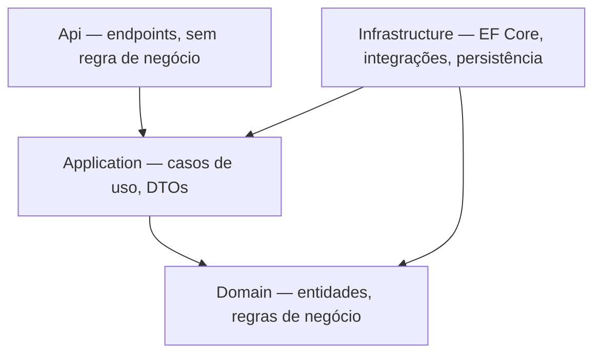

# Engineering Handbook

> Público: Desenvolvedores
> Objetivo: facilitar onboarding e desenvolvimento no BlueprintOS.
> Atualização: contínua.

---

## Arquitetura

O BlueprintOS segue **Modular Monolith + Clean Architecture + DDD pragmático** (ver ADR-0001 e [`.ai/ARCHITECTURE.md`](../.ai/ARCHITECTURE.md)).



Regras principais:

- Módulos se comunicam apenas via Contracts — nunca acessando `Infrastructure`, repositórios ou entidades internas de outro módulo diretamente (ADR-0005).
- `Domain` não referencia nenhuma outra camada.
- Nenhuma regra de negócio em `Api` ou `Infrastructure`.

> Nota: a estrutura alvo descrita em `ARCHITECTURE.md` (`/src/Apps`, `/src/BuildingBlocks`, `/src/Modules`) ainda não foi adotada fisicamente — ver "Estrutura das Pastas" abaixo para o layout real atual (ADR-0006).

---

## Organização do Projeto

O código-fonte do backend vive em `backend/`, com um projeto por camada (não por módulo, ainda):

| Projeto | Camada |
|---|---|
| `BlueprintOS.Domain` | Domain |
| `BlueprintOS.Application` | Application |
| `BlueprintOS.Infrastructure` | Infrastructure |
| `BlueprintOS.Api` | Api (host ASP.NET Core) |
| `BlueprintOS.Core` | Contratos e modelos dos módulos já implementados (AI, Agents, Documentation, Knowledge, Publication, Workflows) |
| `BlueprintOS.Shared` | Utilitários e tipos compartilhados (ex.: `Result`) |

Dentro de `Core`/`Infrastructure`, cada módulo segue `{Módulo}/{Contracts,Models}` (Core) e `{Módulo}/...` (Infrastructure) — ver ADR-0006.

---

## Stack

| Camada | Tecnologia |
|---|---|
| Backend | .NET 9, ASP.NET Core, C# |
| Frontend | React, TypeScript (ainda não iniciado) |
| Banco de dados | SQL Server + Entity Framework Core (oficial; ainda não integrado no código) |
| Autenticação | Microsoft Entra ID (planejado, Fase 1) |
| Infraestrutura | Docker (ativo), Google Cloud Platform |
| PDF | QuestPDF (biblioteca .NET pura) |
| QR Code | QRCoder (`PngByteQRCode`, sem dependência de `System.Drawing`) |
| Testes | xUnit, fakes manuais (sem framework de mocking) |

Ver [`.ai/PROJECT.md`](../.ai/PROJECT.md) §4 para a lista oficial completa.

---

## Ambiente

```bash
# Subir a infraestrutura (Docker)
make up

# Parar
make down

# Ver status
make status
```

Variáveis de ambiente sensíveis (ex.: `AI__OpenAI__ApiKey`) seguem o padrão `.env.example` / `infrastructure/docker/.env.docker.example` — nunca commitadas com valor real.

Para rodar o backend localmente:

```bash
dotnet build backend/BlueprintOS.sln
dotnet test backend/BlueprintOS.sln
dotnet run --project backend/src/BlueprintOS.Api
```

---

## Convenções

Resumo — ver [`.ai/STANDARDS.md`](../.ai/STANDARDS.md) para o guia completo.

| Item | Convenção |
|---|---|
| Idioma do código | Inglês |
| Idioma da documentação | Português |
| Classes / Métodos / Propriedades | PascalCase |
| Interfaces | Prefixo `I` |
| Campos privados | `_camelCase` |
| Variáveis | camelCase |
| Comentários | Evitar; código deve ser autoexplicativo |
| Tratamento de erro | Result Pattern; nunca `throw Exception()` genérico |
| Logging | `ILogger`; nunca `Console.WriteLine()` |
| Tamanho de método | Até ~30 linhas |
| Tamanho de classe | Até ~300 linhas |

Proibido: `#region`, Service Locator, classes estáticas para regra de negócio, SQL concatenado, dependências cíclicas.

---

## Git Flow

Branches:

- `main` — nunca receber commit direto.
- `feature/`, `bugfix/`, `hotfix/`, `release/` — todo trabalho parte daqui.

Commits no formato `tipo: descrição` (ex.: `feat: add planner module`, `fix: correct workflow validation`, `docs: update architecture`).

Fluxo local padrão:

```bash
git add .
git commit -m "tipo: descrição"
git push
```

Todo Pull Request deve conter: objetivo, mudanças, impactos, testes realizados e checklist (ver `.ai/STANDARDS.md` §22).

---

## Estrutura das Pastas

```
backend/
  src/
    BlueprintOS.Api/            # host ASP.NET Core, endpoints, CLI de publicação
    BlueprintOS.Application/    # casos de uso (scaffold)
    BlueprintOS.Domain/         # entidades de domínio (scaffold)
    BlueprintOS.Infrastructure/ # implementações (Documentation, Knowledge, Publication, Memory, Integrations)
    BlueprintOS.Core/           # contratos e modelos (AI, Agents, Documentation, Knowledge, Publication, Workflows)
    BlueprintOS.Shared/         # utilitários compartilhados
  tests/
    BlueprintOS.UnitTests/
    BlueprintOS.IntegrationTests/

docs/                # documentação permanente (este arquivo, Executive Report, Product Blueprint)
.ai/                  # estado operacional da AI Factory (governança, roadmap, decisões, memória)
infrastructure/
  docker/             # docker-compose ativo
  terraform/          # reservado (vazio)
  kubernetes/         # reservado (vazio)
  nginx/              # reservado (vazio)
  monitoring/         # reservado (vazio)
dist/                # saída gerada pelo Publication Engine (não versionado)
```

---

## Testes

- Framework: xUnit, sem biblioteca de mocking — fakes escritos manualmente.
- Prioridade de cobertura: Application → Domain → Integration → End-to-End (ainda não há testes E2E).
- Estado atual: **167 testes unitários + 1 teste de integração, 100% passando**, build sem warnings.

```bash
dotnet test backend/BlueprintOS.sln
```

---

## Deploy

Hoje o deploy é local, via Docker Compose (`make up`), usando `infrastructure/docker/docker-compose.yml`. Terraform, Kubernetes, Nginx e observabilidade estão reservados em `infrastructure/` mas ainda não implementados (ver Roadmap, Fase 4).
