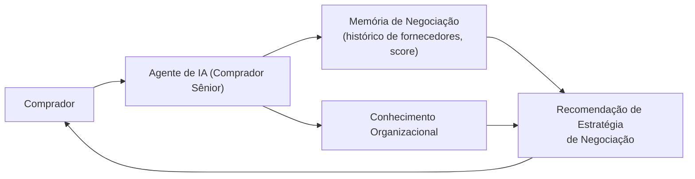

# Product Blueprint

> Público: Cliente
> Objetivo: explicar o +Compras — o que é, que problema resolve e para onde vai.
> Atualização: sempre que houver evolução funcional.

---

## Visão Geral

**+Compras** é o produto de Inteligência Artificial para automação e apoio à área de Compras, o primeiro construído sobre a plataforma **BlueprintOS**. Ele combina agentes especializados, memória de negociação e conhecimento organizacional para apoiar compradores nas decisões do dia a dia.

---

## Problema Resolvido

Áreas de Compras lidam com grande volume de negociações, histórico disperso de fornecedores e decisões que dependem fortemente da experiência individual do comprador. O +Compras existe para tornar esse conhecimento explícito, consistente e reutilizável — apoiando o comprador com dados e recomendações, em vez de substituí-lo.

---

## Objetivos

- Apoiar compradores com recomendações de negociação baseadas em histórico real de fornecedores.
- Reter e reutilizar conhecimento organizacional (políticas, processos, aprendizados).
- Reduzir o tempo gasto reunindo informação dispersa antes de uma negociação.
- Evoluir de forma incremental, sempre resolvendo um problema real do comprador.

---

## Arquitetura Simplificada

O +Compras roda sobre o BlueprintOS, que fornece o runtime de agentes, a memória e o motor de conhecimento como serviços compartilhados — reutilizáveis por futuros produtos da SOMA.

---

## Funcionalidades

Implementadas hoje (fundação do produto):

- **Motor de estratégia de negociação**, que recomenda uma abordagem (ex.: agressiva, conservadora, de parceria) com base no histórico e na urgência de cada negociação.
- **Memória de negociação**, com histórico de fornecedores, preços e score de relacionamento.
- **Agente Comprador Sênior**, que consome essa memória e estratégia para apoiar decisões.
- **Base de conhecimento organizacional**, para consulta por agentes e pessoas.

Planejadas (ver Roadmap):

- Automação de processos de compra de ponta a ponta (módulo Procurement).
- Integração com sistemas ERP.
- Portal para o comprador acompanhar negociações e recomendações.

---

## Jornada do Usuário

Fluxo previsto, à medida que os módulos de Portal e Procurement forem entregues:

1. O comprador abre uma negociação com um fornecedor no +Compras.
2. O sistema recupera o histórico daquele fornecedor (preços, relacionamento, negociações anteriores).
3. O motor de estratégia recomenda uma abordagem de negociação, com justificativa.
4. O comprador conduz a negociação apoiado pela recomendação.
5. O resultado é registrado, alimentando a memória para as próximas negociações.

Hoje, os passos 2 a 4 já existem como capacidade de IA (motor de negociação); os passos 1 e 5, que dependem de um portal e de um fluxo de processo, ainda não foram construídos.

---

## Roadmap

| Fase | O que entrega para o +Compras |
|---|---|
| Fase 0 — Fundação | Base arquitetural e de documentação da plataforma (em andamento) |
| Fase 1 — Módulos Core | Identidade e autenticação, planejamento e execução de fluxos de trabalho |
| Fase 2 — Conhecimento e Memória | Já iniciada: conhecimento organizacional e agentes de IA |
| Fase 3 — Automação e Integrações | Módulo de Procurement e integração com ERPs — onde o +Compras se torna um produto completo |
| Fase 4 — Observabilidade e Escala | Painéis de indicadores e operação em escala |

---

## Benefícios

- Decisões de negociação apoiadas por dados reais, não apenas por memória individual.
- Conhecimento organizacional preservado e reutilizável entre compradores.
- Plataforma (BlueprintOS) pensada para crescer com o produto, sem retrabalho arquitetural.

---

## FAQ

**O +Compras já substitui o comprador?**
Não. Ele apoia a decisão com dados e recomendações; a decisão final é do comprador.

**O +Compras já está pronto para uso?**
O produto está em construção. As capacidades de IA (negociação, conhecimento, agentes) já existem; o portal e a automação de processo de compras ainda estão no roadmap.

**Os dados de fornecedores ficam seguros?**
A segurança é um requisito de escopo da plataforma (autenticação corporativa, autorização, LGPD); o módulo de Identidade que implementa isso ainda está no roadmap (Fase 1).
