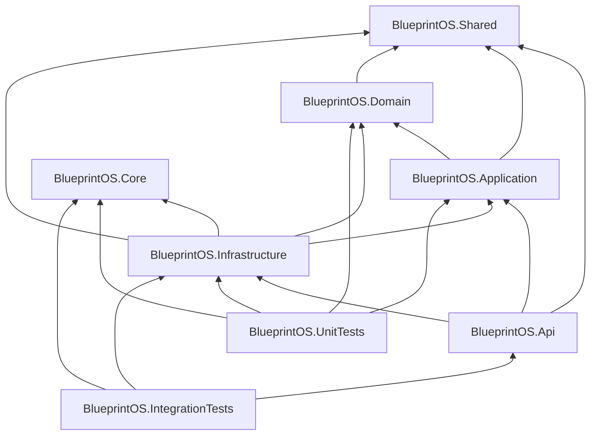

# Architecture Review — Etapa 4

> **Documento arquivado — desatualizado desde 03/08/2026.**
>
> Esta revisão analisou o baseline do commit `7acff2a`, em 30/07/2026.
> Desde então:
>
> - `BlueprintOS.Domain` e `BlueprintOS.Application`, descritos neste documento
>   como vazios, passaram a conter o vertical slice de Fornecedores, com
>   entidades, casos de uso e contratos reais. A principal recomendação desta
>   revisão foi implementada.
> - A suíte de testes cresceu de 231 para 286 testes aprovados.
> - O Docker foi removido do fluxo de desenvolvimento, mudança não contemplada
>   nesta revisão.
>
> Consulte `.ai/ENGINEERING_BLUEPRINT.md` e `.ai/PROJECT_STATE.md` para o estado
> atual. Este documento é mantido exclusivamente como registro histórico da
> análise que antecedeu o primeiro vertical slice de procurement.

**Data da revisão:** 30 de julho de 2026  
**Escopo:** análise estática integral da solução e validação por build/testes.  
**Baseline revisado:** `main` no commit `7acff2a`  
**Natureza:** exclusivamente analítica. Nenhum código-fonte, namespace, classe ou comportamento foi alterado.

## Resumo executivo

O SOMA BlueprintOS possui uma fundação técnica limpa e bem testada para três capacidades internas: runtime de IA, memória/estratégia de negociação e geração/publicação de documentação. A direção das referências entre projetos está, em geral, correta e a separação entre contratos em `Core` e implementações em `Infrastructure` é um ponto forte.

Por outro lado, a solução ainda não materializa o núcleo de produto corporativo prometido para o +COMPRAS. `BlueprintOS.Domain`, `BlueprintOS.Application` e `BlueprintOS.Shared` estão presentes como projetos e estrutura de pastas, mas não contêm arquivos C# rastreados. Na prática, a maior parte da lógica está em `BlueprintOS.Core`, que acumula contratos, modelos, agentes, workflows, memória, negociação, documentação e publicação. A API expõe somente `GET /health`; os modos de publicação são comandos do host, não APIs de negócio.

Conclusão: a arquitetura é uma boa base de protótipo/plataforma interna e deve evoluir por melhorias incrementais e módulos reais. Uma grande refatoração antecipada não é recomendada. Antes de expandir funcionalidades de procurement, entretanto, é necessário criar o primeiro fluxo vertical com domínio, caso de uso, persistência e fronteira de API claros.

## Evidências e validação

| Verificação | Resultado |
|---|---|
| `dotnet build backend/BlueprintOS.sln --no-restore` | Aprovado: 0 erros, 4 avisos |
| `dotnet test backend/BlueprintOS.sln --no-build` | 231 aprovados, 0 falhos, 0 ignorados |
| Testes unitários | 230 aprovados |
| Testes de integração | 1 aprovado |
| Alterações funcionais nesta etapa | Nenhuma |

Os quatro avisos são `NU1900`: o SDK não conseguiu consultar o feed de vulnerabilidades em `https://api.nuget.org/v3/index.json`. Eles não são avisos de compilação do código, mas deixam a verificação de vulnerabilidades de dependências incompleta no ambiente analisado.

## 1. Estrutura da solução e dependências

### Responsabilidade efetiva dos projetos

| Projeto | Responsabilidade observada | Avaliação |
|---|---|---|
| `BlueprintOS.Api` | Host ASP.NET Minimal API, endpoint de saúde e três comandos de publicação. | Fino e sem regras de negócio; adequado no estado atual. |
| `BlueprintOS.Application` | Estrutura prevista para casos de uso. | Vazio; camada ainda não materializada. |
| `BlueprintOS.Domain` | Estrutura prevista para entidades, eventos e value objects. | Vazio; domínio de negócio ainda não materializado. |
| `BlueprintOS.Core` | Contratos e modelos de IA, agentes, workflows, memória, negociação, conhecimento, documentação e publicação. | Funcional, mas amplo demais para ser uma fronteira de módulo sustentável. |
| `BlueprintOS.Infrastructure` | DI, OpenAI, conhecimento Markdown, memória em processo, geração/publicação/renderização de documentos. | Implementações bem separadas por contratos; concentra a maior parte do código. |
| `BlueprintOS.Shared` | Estrutura prevista para utilitários/resultado compartilhado. | Vazio. |
| Testes | Testes unitários do Core/Infrastructure e uma integração de IA. | Cobertura de fundação forte; baixa evidência de testes de API e negócio ponta a ponta. |

### Diagrama de referências de projetos

### Diagnóstico de camadas

- A direção de referências está correta: `Domain` não referencia `Infrastructure`; `Application` não referencia ASP.NET; e `Api` é a borda externa.
- `Infrastructure` referencia `Application`, `Domain`, `Core` e `Shared`. Isso é compatível com Clean Architecture quando ela implementa portas internas; contudo, como `Domain` e `Application` não possuem tipos, a fronteira não é exercitada por código real.
- Não há controllers nem regras de negócio no host. `Program.cs` contém roteamento de comandos, composição de DI e `/health`, o que é aceitável hoje. Caso os comandos cresçam, devem migrar para um host CLI próprio para que a API não se torne um ponto de acoplamento operacional.
- As pastas `Identity`, `Messaging`, `Persistence`, `Controllers`, `Endpoints`, `Filters` e `Middleware` existem em parte como intenção arquitetural, mas não têm implementação rastreada. Elas não devem ser interpretadas como capacidade pronta.

## 2. Clean Architecture

| Questão | Resultado | Classificação |
|---|---|---|
| Domain depende de Infrastructure? | Não. | Conforme. |
| Application conhece ASP.NET? | Não há código de Application; não há referência a ASP.NET. | Conforme, porém não comprovado por casos de uso reais. |
| Infrastructure depende de contratos internos? | Sim, principalmente contratos/modelos em `Core`; também referencia projetos internos vazios. | Parcialmente comprovado. |
| API contém regra de negócio? | Não. Há somente health check e invocação de serviços de publicação. | Conforme. |
| Serviços estão na camada correta? | Renderização, OpenAI, armazenamento em memória e publicação ficam em Infrastructure; workflow e estratégia ficam em Core. | Parcial: a camada Core mistura tipos de naturezas diferentes. |
| Há vazamento de infraestrutura? | Não há evidência de tipos ASP.NET/HTTP dentro de Core. O contrato de IA é independente; a implementação OpenAI fica em Infrastructure. | Conforme. |

### Violações ou fragilidades classificadas

| Prioridade | Achado | Evidência | Consequência |
|---|---|---|---|
| Alta | Camadas Domain/Application são estruturais, não operacionais. | Nenhum arquivo C# rastreado nesses projetos. | O primeiro módulo de produto tenderá a ir para `Core`/`Infrastructure` por conveniência, consolidando o acoplamento. |
| Média | `Core` atua como camada técnica e como contêiner de vários subdomínios. | IA, negociação, docs, publicação, conhecimento e workflows convivem no mesmo projeto. | Conflitos de evolução e dependências internas crescem com cada módulo. |
| Média | CLI de publicação está dentro do host web. | Modos `publish`, `publish-docs` e `publish-executive-blueprint` em `Program.cs`. | O host poderá concentrar responsabilidades se comandos e API crescerem juntos. |
| Média | Métricas de qualidade executam build síncrono no fluxo de publicação. | `QualityMetricsProvider.RunBuildAsync`. | A publicação depende de SDK, solução, cache e conectividade do NuGet; aumenta latência e falhas operacionais. |

## 3. Domain-Driven Design

### Estado do domínio

O domínio ainda é predominantemente anêmico — ou, mais precisamente, ainda não foi instituído no projeto `Domain`. Existem modelos e regras úteis de negociação em `Core.AI.Negotiation` e `Core.AI.Memory`, como `NegotiationMemory`, `NegotiationStrategy`, histórico de preço e regras de estratégia. Eles formam uma base algorítmica promissora, porém não demonstram agregados de procurement, entidades protegendo invariantes, eventos de domínio ou casos de uso que orquestrem transações de negócio.

Não foram encontradas evidências implementadas de bounded contexts corporativos para requisição, fornecedor, catálogo, cotação, pedido, aprovação, contrato ou recebimento. Também não há persistência durável que dê significado transacional a esses modelos.

### Avaliação DDD

| Elemento | Situação | Observação |
|---|---|---|
| Entidades e agregados | Não comprovados no projeto Domain. | Modelos de negociação são POCOs/modelos de suporte no Core. |
| Value objects | Não comprovados no projeto Domain. | Pastas existem, sem implementação rastreada. |
| Serviços de domínio | Parcial. | `NegotiationStrategy` encapsula decisões; sua localização deveria ser definida quando houver o bounded context de negociação. |
| Invariantes | Parcial e local. | Há cálculos e regras, mas não uma fronteira de agregado que assegure invariantes de procurement. |
| Eventos de domínio | Não comprovados. | Pasta existe; não há código rastreado. |
| Linguagem ubíqua | Parcial. | O vocabulário de negociação é consistente, mas ainda não há modelo ubíquo do ciclo de compras. |
| Bounded contexts | Planejados, não implementados. | Os atuais agrupamentos são técnicos, não contextos de negócio. |

Recomendação: introduzir DDD apenas ao criar uma capacidade aprovada. Começar com um agregado pequeno e útil, em vez de tentar preencher artificialmente `Domain` com tipos genéricos.

## 4. SOLID

| Princípio | Avaliação | Exemplos concretos |
|---|---|---|
| SRP | Bom, com pontos de atenção. | `OpenAIProvider`, renderizadores e regras de negociação têm responsabilidade focada. `DocumentationHealthService` (análise de conteúdo, estrutura, links, duplicidade e renderização) e `PdfRenderer` (layout completo) acumulam mais de uma razão para mudar. |
| OCP | Bom. | `IContentRenderer`, `IReportPublisher`, `INegotiationStrategyRule` e `IAIProvider` permitem novas implementações sem mudar os consumidores principais. |
| LSP | Sem violação material comprovada. | Há contratos pequenos e implementações diretas; faltam testes de contrato compartilhados para assegurar equivalência futura entre providers/publishers. |
| ISP | Bom, com risco de granularidade excessiva. | Geradores de documentação têm interfaces específicas; isso reduz acoplamento, mas 19 contratos/registrations para conteúdo estático pode elevar custo de composição. |
| DIP | Bom no runtime/publicação; parcial no ciclo de vida de agentes. | `AIRuntime` depende de `IAIProvider`, e publicação depende de contratos. `AgentFactory` usa reflexão e assinaturas de construtor como contrato implícito, em vez de uma abstração explícita de registro/fábrica. |

## 5. Dependency Injection e composition root

`ServiceCollectionExtensions.AddInfrastructure` concentra o composition root e torna todas as capacidades atuais localizáveis. A separação de registro e implementação é clara. Há uma única integração HTTP registrada com `AddHttpClient<IAIProvider, OpenAIProvider>`, o que é adequado como base.

Pontos de atenção:

- Quase todos os serviços são `Singleton`, incluindo memória e serviços que podem vir a manter estado. Isso é seguro para as implementações atuais em processo quando deliberadamente thread-safe, mas não define uma política de lifetime para operações de usuário, transações ou isolamento por tenant.
- Não foram identificados serviços DI concretamente órfãos no conjunto analisado; porém o próprio `WorkflowRunner` não aparece no composition root, indicando que workflow ainda é uma biblioteca, não uma capacidade hospedada.
- `AgentFactory` instancia agentes por reflexão e suporta apenas os construtores exatos `(IAIRuntime)` ou `(IAIRuntime, IKnowledgeService)`. Esse contrato é frágil, pouco descobrível em tempo de compilação e não oferece nomes, versões, metadados, políticas nem isolamento.
- O composition root único será um gargalo de colaboração quando houver módulos independentes. A evolução recomendada é cada módulo registrar um método próprio e o host apenas os compor.

## 6. Runtime de IA, agentes, ferramentas e memória

### Estado atual

- `AIRuntime` seleciona um `IAIProvider` pelo nome configurado no modelo e delega a execução; se não houver provider, lança uma exceção clara.
- A integração OpenAI fica em Infrastructure e usa `HttpClient` configurado via opções — uma boa separação entre contrato e vendor.
- Há agentes concretos e uma fábrica, além de `KnowledgeAgent` e suporte a conhecimento Markdown.
- `WorkflowRunner` executa passos em sequência, passando `AgentResult.Output` como texto para o próximo passo.
- A memória de negociação usa um store em memória com `ConcurrentDictionary`; os cálculos de score e estratégia têm testes unitários.

### Limites de escala

| Escala | Diagnóstico |
|---|---|
| Dezenas de agentes | Não de forma operacionalmente segura sem evolução. A fábrica por reflexão, o registro implícito, a ausência de telemetria e a falta de execução assíncrona/persistente dificultam operar dezenas de agentes. |
| Centenas de agentes | Não. Seriam necessários catálogo/registry explícito, políticas por agente, versionamento, ferramentas com permissões, quotas, rastreabilidade, filas e estado durável. |
| Workflows críticos | Não. O runner atual não oferece retries, compensação, persistência, idempotência, aprovações humanas, timeout por etapa ou trilha de auditoria. |
| Memória corporativa | Não. O store é local ao processo, sem durabilidade, tenant isolation, retenção, busca semântica ou governança de dados. |

O código é uma boa prova de conceito de orquestração sequencial, mas ainda não é um runtime de agentes corporativo multi-tenant.

## 7. Publication Engine

O Publication Engine é a área mais madura do repositório. A representação comum (`PublicationDocument`, seções, blocos e assets), os três `IContentRenderer` (Markdown, HTML e PDF) e os três publishers por audiência mostram boa separação entre conteúdo, tema, renderização e saída. `DocumentAssembler` reduziu duplicação entre os publishers e é uma decisão positiva de manutenção.

Oportunidades de simplificação:

- Separar a coleta de métricas de build da publicação. Métricas devem vir de CI/artifacts ou de uma porta que possa ter cache e timeout, não de `ProcessStartInfo("dotnet", "build ...")` no caminho crítico de geração.
- Decompor `DocumentationHealthService` em analisadores de conteúdo, estrutura, links e duplicidade, mantendo um agregador de relatório. Não é uma refatoração urgente, mas melhora a extensibilidade das regras.
- Manter `PdfRenderer` como adaptador de layout, porém isolar regras de composição de blocos se novos formatos e templates aumentarem. Hoje ele é coeso para um único formato, mas tende a crescer rapidamente.
- Avaliar se todos os geradores de documentação precisam de interfaces próprias. A granularidade atual privilegia extensibilidade e testes, mas pode ser reduzida se os módulos forem sempre publicados juntos.

## 8. Code smells e concentração de responsabilidade

| Tipo | Evidência | Severidade | Recomendação |
|---|---|---|---|
| God service emergente | `DocumentationHealthService` concentra várias análises e a renderização textual do resultado. | Média | Extrair analisadores quando novas regras forem adicionadas. |
| Serviço algorítmico denso | `NegotiationMemory` combina atualização, cálculo e consulta de histórico. | Média | Ao criar o bounded context, separar políticas de score e um repositório de domínio. |
| Renderer grande | `PdfRenderer` contém capa, índice, seção, imagem, tabela, anexos e formatação inline. | Média | Extrair composers por bloco somente se o PDF receber novas variações. |
| Contrato implícito/reflexão | `AgentFactory.Create<TAgent>()`. | Alta para expansão de agentes | Adotar registry/factory explícito antes de multiplicar agentes. |
| Primitive/data clumps | Não há ocorrência grave comprovada. | Baixa | Reavaliar identificadores, preço/moeda e contexto de negociação ao modelar o domínio real. |
| Shotgun surgery potencial | Registro global de DI e Core abrangente. | Média | Criar composição por módulo e testes de arquitetura. |

Não foi encontrada uma God Class inequívoca. Os arquivos maiores possuem responsabilidades relacionadas, mas são riscos de crescimento, não prova de mau desenho atual.

## 9. Escalabilidade e evolução

| Cenário | Prontidão | Primeiro ponto de ruptura |
|---|---|---|
| 20 módulos | Parcial. | `Core` e o composition root global se tornam dependências centrais e fonte de conflitos. |
| 50 agentes | Baixa. | Factory reflexiva, ausência de registry/políticas e falta de execução observável/durável. |
| 100 integrações | Baixa. | Não há convenção de adapters, resiliência, health checks, idempotência, gestão de segredos ou rate limiting por integração. |
| 500 mil linhas de código | Baixa no desenho físico atual. | Projetos técnicos globais e documentação/DI centralizados inviabilizam ownership modular. |

Não é a quantidade de linhas que quebraria primeiro; seriam os limites de módulo, operação e estado: persistência/tenant, execução assíncrona dos agentes, observabilidade e ownership de integrações.

## 10. Pontos fortes

1. Direção de dependências entre projetos é saudável e não há vazamento ASP.NET para o Core observado.
2. 231 testes aprovados, especialmente em lógica de Core e Infrastructure, dão boa segurança à fundação existente.
3. Contratos de provider, renderer, publisher e regras tornam runtime/publicação extensíveis.
4. A separação entre renderização, templates, assets e montagem de documentos é consistente.
5. Uso de `HttpClient` tipado, opções e DI central fornece uma base clara para integrações futuras.

## 11. Riscos prioritários

1. **Alta — ausência de slice de produto:** sem domínio, casos de uso, persistência e API de negócio, novas funcionalidades podem contornar Clean Architecture por conveniência.
2. **Alta — runtime de agentes não operacional para escala:** não há registry, política, estado, fila, telemetria, isolamento ou governança de ferramentas.
3. **Alta — ausência de fundações corporativas:** autenticação/autorização, persistência, mensageria, auditoria e isolamento por tenant não estão implementados.
4. **Média — publicação acoplada a build local:** a geração pode falhar ou ficar lenta por SDK/cache/rede, como demonstrado pelos avisos de consulta NuGet.
5. **Média — modularidade física insuficiente:** `Core` e DI global serão gargalos antes de muitos módulos/integrações.

## 12. Cinco melhorias de maior impacto

Estas são recomendações arquiteturais; não autorizam implementação fora de Work Order aprovada.

1. Implementar o primeiro fluxo vertical de procurement aprovado com agregado real no `Domain`, caso de uso no `Application`, porta de persistência e endpoint/API fino.
2. Definir uma convenção de módulos (contratos públicos, dependências permitidas e registro DI por módulo) e automatizá-la com testes de arquitetura.
3. Substituir progressivamente a fábrica reflexiva por um registry explícito de agentes com metadados, permissões, versionamento e telemetria; introduzir jobs persistentes antes de escalar agentes.
4. Introduzir fundações operacionais antes de fluxos críticos: persistência durável, auditoria, autenticação/autorização, configuração/segredos, resiliência de integração e observabilidade.
5. Desacoplar métricas de qualidade do processo de publicação e, quando necessário, dividir os componentes de saúde/renderização por responsabilidade.

## 13. Roadmap arquitetural recomendado

### Curto prazo — antes de ampliar o produto

- Escolher somente uma Work Order funcional aprovada e implementar um vertical slice completo.
- Definir o bounded context e a linguagem ubíqua desse slice, com invariantes verificáveis por testes.
- Criar testes de arquitetura para impedir referências proibidas e evitar que `Core` absorva todo novo código.

### Médio prazo — antes de múltiplos módulos/agentes

- Transformar a composição global em composição por módulo.
- Estabelecer persistência, identidade/autorização, auditoria e mensageria/outbox conforme a necessidade aprovada.
- Criar execução de workflows com estado, idempotência, timeout, retry/compensação e human-in-the-loop.
- Criar catálogo de agentes, ferramentas e integrações com políticas explícitas.

### Longo prazo — plataforma corporativa

- Separar contextos de procurement por ownership e contratos estáveis.
- Escalar observabilidade, governança de dados/IA, tenancy e operações assíncronas.
- Considerar extração de serviços somente quando limites de contexto, carga e ownership justificarem; manter modular monolith enquanto esses sinais não existirem.

## 14. Score

| Dimensão | Nota | Justificativa |
|---|---:|---|
| Arquitetura | 6,5 | Estrutura de projetos e dependências é boa, mas as camadas de produto ainda são vazias. |
| Clean Architecture | 7,0 | Direção de dependências é adequada e API é fina; falta comprovação em casos de uso reais. |
| DDD | 3,0 | Há regras algorítmicas de negociação, mas não há domínio, agregados ou bounded contexts de procurement implementados. |
| SOLID | 7,0 | Bons contratos e extensibilidade; reflexão e alguns serviços densos reduzem a nota. |
| Organização | 6,0 | Pastas/projetos são claros, porém há muita estrutura ainda sem conteúdo e Core é amplo. |
| Modularidade | 5,0 | Componentes internos são separáveis, mas não há limites físicos/ownership por módulo de negócio. |
| Escalabilidade | 3,5 | Funciona para a fundação atual; agentes, integrações, estado e operação não suportam expansão corporativa ainda. |
| Testabilidade | 8,0 | 231 testes aprovados e contratos claros; faltam fluxos de produto/API e testes de contrato. |
| Evolução | 6,0 | Boa base incremental, desde que se estabeleçam limites antes de crescer. |
| Qualidade geral | 6,0 | Código de fundação cuidadoso e testado, ainda distante de uma plataforma corporativa de procurement completa. |

## Conclusão

A arquitetura está pronta para evoluir incrementalmente a partir da fundação existente, mas **não está pronta para escalar** para dezenas de módulos, 50 agentes, 100 integrações ou centenas de milhares de linhas sem consolidar os limites de domínio, módulos e operação.

Recomenda-se **melhoria incremental orientada por Work Orders aprovadas**, e não uma grande refatoração agora. A prioridade arquitetural é fazer o próximo fluxo de negócio nascer corretamente em Domain/Application/API/Persistence, usando-o para validar as convenções que depois serão repetidas pelo restante do +COMPRAS.
