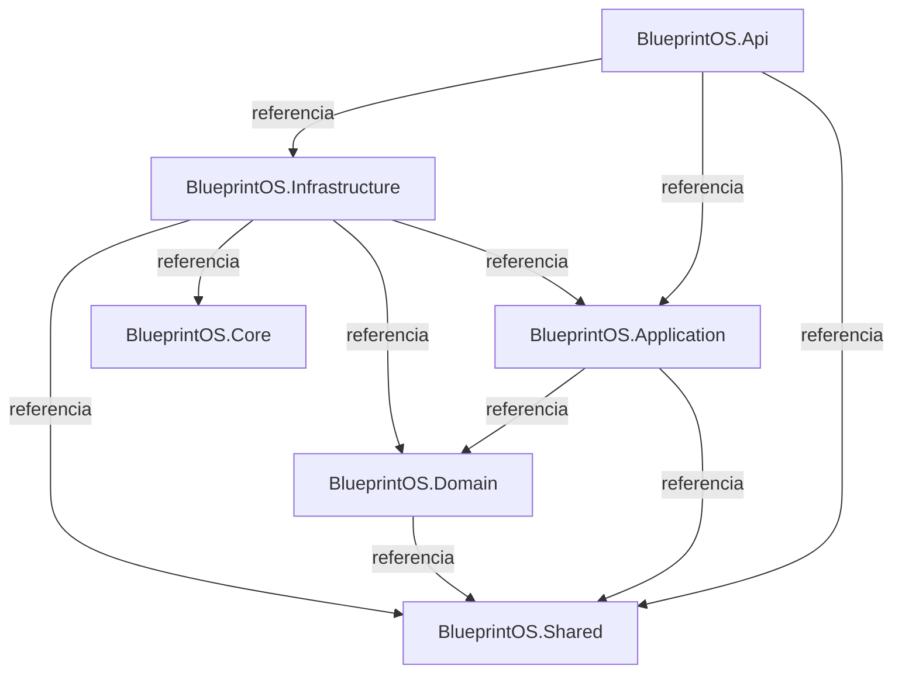

# Diagrama de Arquitetura

> Documento gerado automaticamente pelo Portal de Documentação Viva do BlueprintOS. Não editar manualmente.

- **Versão:** 1.0.0
- **Gerado em:** 2026-07-23 03:43:24 UTC
- **Última atualização:** 2026-07-23

---

## Diagrama de dependências entre projetos

Grafo real de referências de projeto (`ProjectReference`) entre os projetos
`.csproj` do backend:

