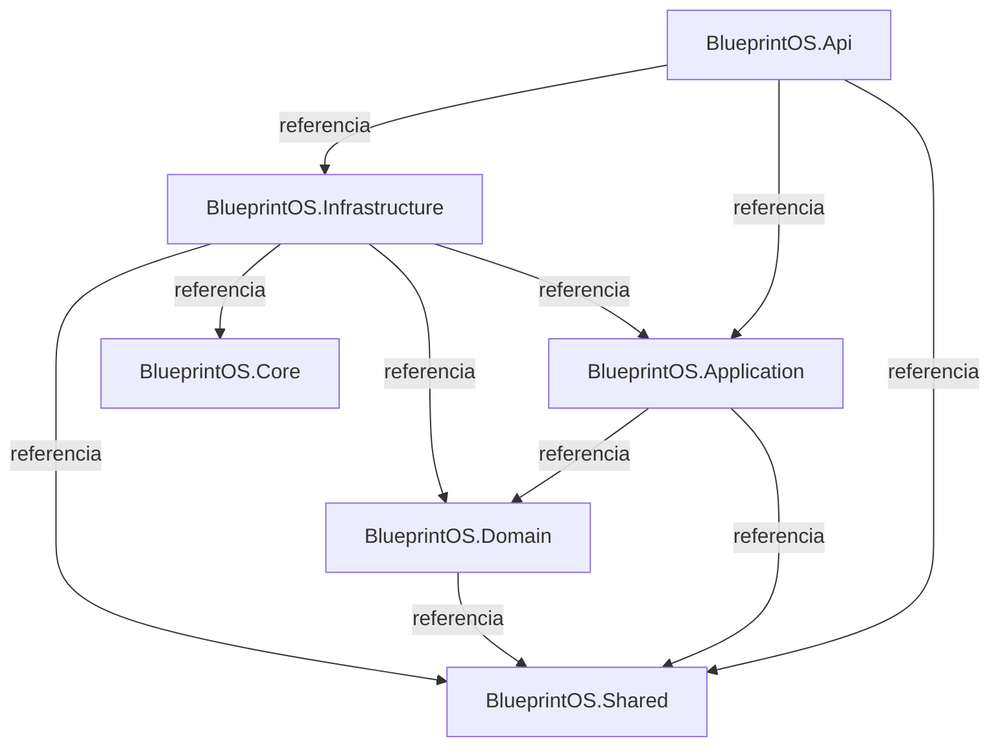

# Diagrama de Arquitetura

> Documento gerado automaticamente pelo Portal de Documentação Viva do BlueprintOS. Não editar manualmente.

- **Versão:** 1.0.0
- **Gerado em:** 2026-08-05 15:25:57 UTC
- **Última atualização:** 2026-08-05

---

## Diagrama de dependências entre projetos

Representação mantida manualmente das referências de projeto (`ProjectReference`)
entre os projetos `.csproj` do backend; deve ser atualizada quando essas referências mudarem:

```mermaid
graph TD
    Api[BlueprintOS.Api]
    Application[BlueprintOS.Application]
    Domain[BlueprintOS.Domain]
    Infrastructure[BlueprintOS.Infrastructure]
    Core[BlueprintOS.Core]
    Shared[BlueprintOS.Shared]
    Api -->|referencia| Application
    Api -->|referencia| Infrastructure
    Api -->|referencia| Shared
    Application -->|referencia| Domain
    Application -->|referencia| Shared
    Domain -->|referencia| Shared
    Infrastructure -->|referencia| Application
    Infrastructure -->|referencia| Core
    Infrastructure -->|referencia| Domain
    Infrastructure -->|referencia| Shared
```
