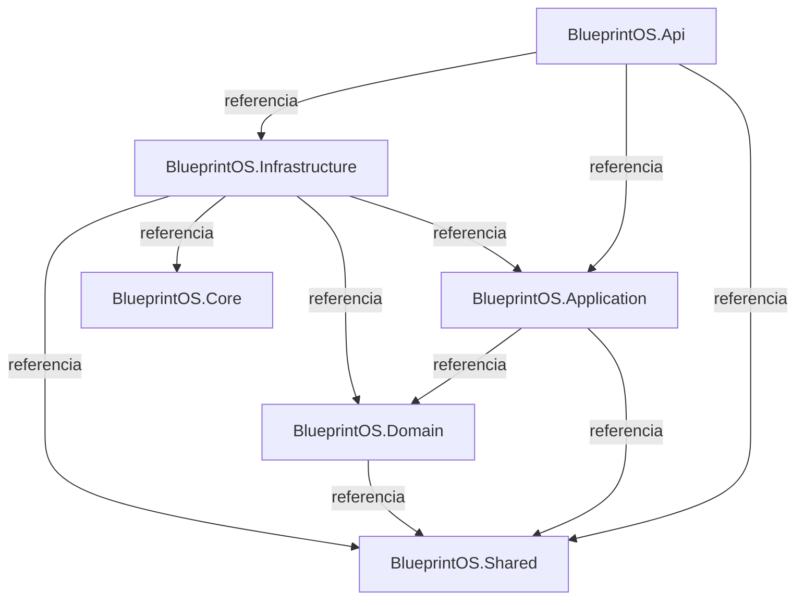

# BlueprintOS

## Executive Blueprint

| Campo | Informação |
|---|---|
| Versão | 1.0.0 |
| Data | 23 de julho de 2026 |
| Status do projeto | Em evolução — Fase 0: Fundação |
| Público-alvo | Diretoria |
| Classificação | Institucional |

> Documento executivo consolidado do BlueprintOS. Foco em negócio: problema, visão, capacidades, benefícios e roadmap. Detalhes de implementação técnica estão no Engineering Handbook.

## Sumário

1. [Executive Summary](#1-executive-summary)
2. [Problema de negócio](#2-problema-de-negócio)
3. [Visão da Plataforma](#3-visão-da-plataforma)
4. [Capacidades do BlueprintOS](#4-capacidades-do-blueprintos)
5. [Benefícios esperados](#5-benefícios-esperados)
6. [Roadmap Executivo](#6-roadmap-executivo)
7. [Estado atual](#7-estado-atual)
8. [Próximos passos](#8-próximos-passos)
9. [Visão de Arquitetura](#9-visão-de-arquitetura)

---

## 1. Executive Summary

O SOMA BlueprintOS é uma plataforma corporativa que automatiza processos de negócio por meio de agentes de inteligência artificial, com foco inicial em documentação viva e negociação de compras. O projeto está na Fase 0 (Fundação), com bases de arquitetura, padrões e documentação já entregues.

- **Sprints concluídas:** 3 (A7, A8, A9).
- **Última sprint concluída:** Sprint A9 — geração automática de relatórios institucionais.
- **Build/testes:** passando, 184 testes automatizados.

---

## 2. Problema de negócio

O problema de negócio específico e sua quantificação (custo atual, tempo perdido, risco) ainda não estão formalmente documentados. Esta seção será detalhada conforme evolução do produto.

---

## 3. Visão da Plataforma

O BlueprintOS é planejado para ser modular, escalável, seguro e multiempresa, automatizando processos de negócio por meio de agentes de IA especializados — com governança e rastreabilidade de decisões como pilares de operação.

O produto está em estágio inicial: a aplicação executável hoje é o backend de automação; a camada de usuário final (frontend) ainda está planejada.

---

## 4. Capacidades do BlueprintOS

Capacidades já implementadas na plataforma:

- **Documentação viva:** geração automática de documentação executiva, de cliente e de engenharia, com versionamento e histórico de mudanças.
- **Conhecimento organizacional:** ingestão e consulta de conteúdo interno da empresa.
- **Agentes de IA:** agentes especializados (ex.: consulta a conhecimento) operando sobre um runtime comum de IA.
- **Negociação de compras:** memória de negociação e estratégia de negociação automatizada para o processo de Buyer sênior (urgência, histórico de fornecedor, faixa de preço).

Capacidades além destas ainda não foram implementadas; ver Roadmap Executivo.

---

## 5. Benefícios esperados

- **Fundação (Fase 0)** — base sólida de arquitetura e processo antes de investir em funcionalidade de negócio, reduzindo retrabalho futuro.
- **Módulos Core (Fase 1)** — identidade, planejamento e automação de processo como alicerce para os demais módulos.
- **Conhecimento e Memória (Fase 2)** — capacidade da plataforma de reter e recuperar conhecimento organizacional e operar agentes de IA.
- **Automação e Integrações (Fase 3)** — conexão com processos de negócio reais e sistemas externos da empresa.
- **Observabilidade e Escala (Fase 4)** — plataforma pronta para operação em produção, multiempresa e em escala.

---

## 6. Roadmap Executivo

O BlueprintOS está atualmente na **Fase 0 — Fundação**, em andamento.

| Fase | Objetivo de negócio | Status |
|---|---|---|
| 0 — Fundação | Estabelecer bases de arquitetura, padrões e processo | Em andamento |
| 1 — Módulos Core | Entregar identidade, planejamento e automação de processo | Planejado |
| 2 — Conhecimento e Memória | Plataforma capaz de reter conhecimento e operar agentes de IA | Planejado |
| 3 — Automação e Integrações | Conectar a plataforma a processos e sistemas externos | Planejado |
| 4 — Observabilidade e Escala | Operação em produção, multiempresa e em escala | Planejado |

---

## 7. Estado atual

| Indicador | Estado |
|---|---|
| Fase do projeto | Fase 0 — Fundação (em andamento) |
| Sprints concluídas | 3 (A7, A8, A9) |
| Última entrega | Sprint A9 — geração automática de relatórios institucionais |
| KPIs de negócio | Ainda não existem; produto não está em operação/produção |
| Dívidas técnicas em aberto | 13 (acompanhadas pela equipe de engenharia) |

---

## 8. Próximos passos

1. Documentar o problema de negócio e sua quantificação.
2. Definir e registrar o escopo da próxima sprint.
3. Avançar os módulos da Fase 1 (identidade, planejamento e automação de processo).
4. Evoluir conhecimento e memória organizacional para uso ampliado por agentes de IA.
5. Iniciar o planejamento do frontend para usuários finais.

---

## 9. Visão de Arquitetura

