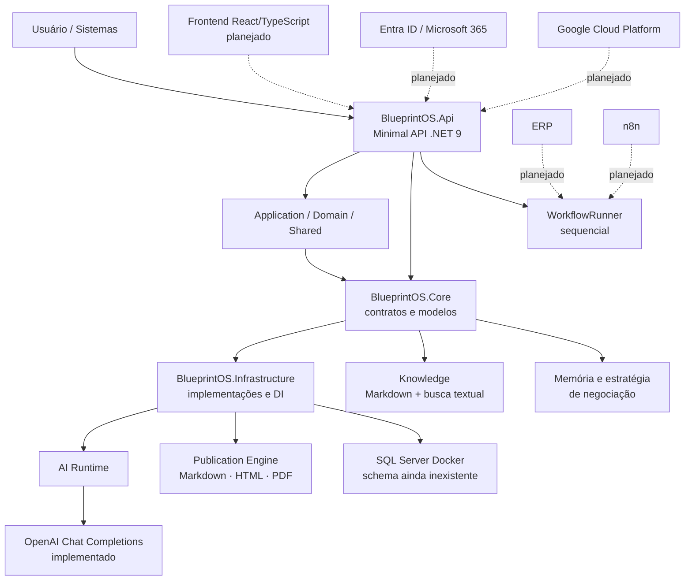
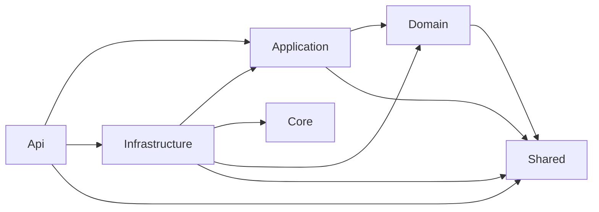
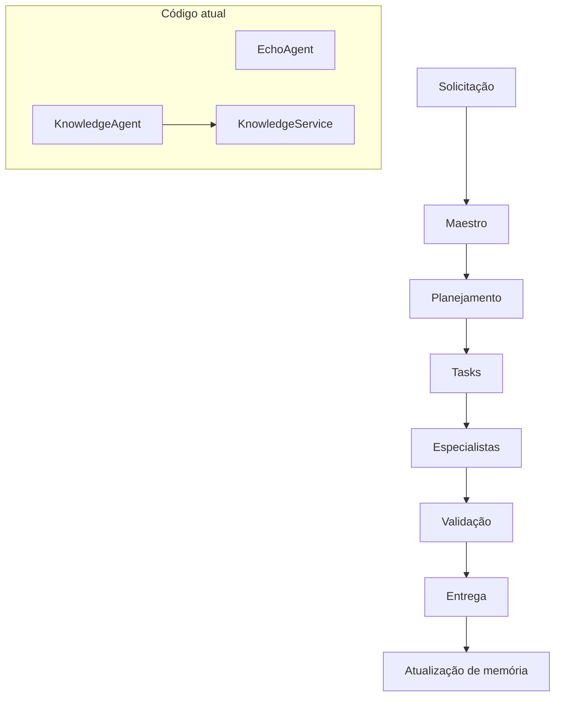
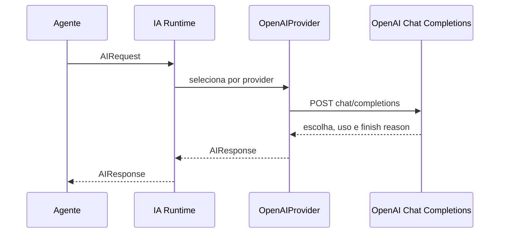
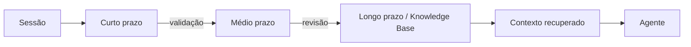
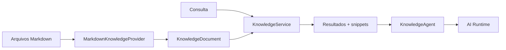
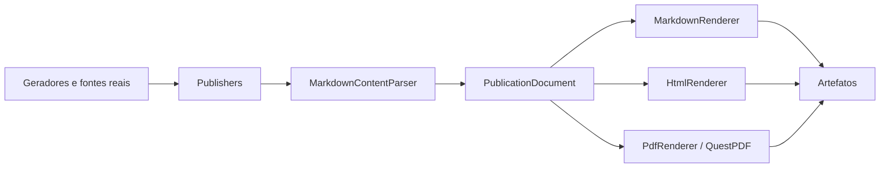
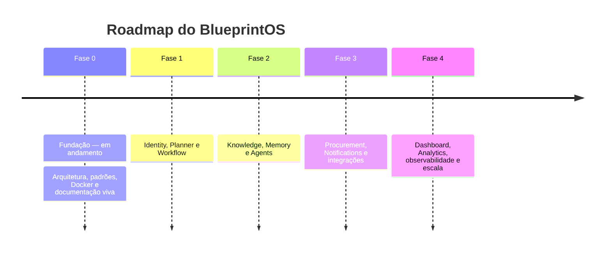

# BlueprintOS

## Executive Blueprint

| Campo | Informação |
|---|---|
| Versão | 1.0.0 |
| Data | 23 de julho de 2026 |
| Status do projeto | Em evolução — Fase 0: Fundação |
| Autores | Consolidação das fontes oficiais do repositório BlueprintOS |
| Classificação | Institucional |

> Este é o documento consolidado do BlueprintOS. Ele registra fatos existentes no repositório e distingue explicitamente arquitetura-alvo, roadmap e funcionalidades implementadas. Na ausência de evidência documental, a lacuna é declarada.

## Sumário

1. [Executive Summary](#1-executive-summary)
2. [Visão geral](#2-visão-geral-da-plataforma)
3. [Arquitetura geral](#3-arquitetura-geral)
4. [Organização do projeto](#4-organização-do-projeto)
5. [Ecossistema de agentes](#5-ecossistema-de-agentes)
6. [AI Runtime](#6-ai-runtime)
7. [Sistema de memória](#7-sistema-de-memória)
8. [Knowledge Engine](#8-knowledge-engine)
9. [Publication Engine](#9-publication-engine)
10. [Integrações](#10-integrações)
11. [Arquitetura técnica](#11-arquitetura-técnica)
12. [Roadmap](#12-roadmap)
13. [Estado atual](#13-estado-atual-do-projeto)
14. [Tecnologias](#14-tecnologias)
15. [ADRs](#15-adrs)
16. [Próximos passos](#16-próximos-passos)

---

## 1. Executive Summary

O SOMA BlueprintOS é uma plataforma corporativa de IA concebida para automatizar processos de negócio por meio de agentes especializados, workflows, memória, planejamento e integração com sistemas corporativos. A proposta combina governança operacional da AI Factory com uma base técnica modular em .NET.

| Necessidade | Resposta documentada |
|---|---|
| Coordenar solicitações complexas | Maestro, Tasks e especialistas da AI Factory |
| Reter conhecimento organizacional | Knowledge Base, memória em camadas e RAG como arquitetura-alvo |
| Evoluir sem acoplamento excessivo | Modular Monolith, Clean Architecture, DDD pragmático e Contracts |
| Tornar decisões e entregas rastreáveis | ADRs, documentação viva, changelog e Publication Engine |
| Publicar informação institucional com consistência | Markdown, HTML e PDF a partir de um modelo comum |

### Benefícios comprovados no estado atual

- Backend .NET 9 com API, contratos, DI e testes.
- Runtime de IA desacoplado de provedor, com OpenAI Chat Completions implementado.
- `EchoAgent` e `KnowledgeAgent` implementados; busca de conhecimento em arquivos Markdown.
- Memória e estratégia de negociação para o domínio de Buyer sênior.
- Portal de Documentação Viva e Publication Engine entregues nas Sprints A8 e A9.

### Estágio e próximo horizonte

O roadmap mantém o projeto na Fase 0 — Fundação. O histórico registra A7, A8 e A9 concluídas; a sprint atual, seu objetivo e épicos formais não estão documentados porque `.ai/CURRENT_SPRINT.md` está vazio. A sequência planejada é Identity, Planner e Workflow; depois Knowledge, Memory e Agents; integrações; e observabilidade/escala.

---

## 2. Visão geral da plataforma

O BlueprintOS é planejado para ser modular, escalável, seguro e multiempresa. A aplicação executável atual é um backend Minimal API. React/TypeScript, SQL Server com EF Core, GCP e Microsoft Entra ID são tecnologias oficiais e direções de produto; não devem ser confundidas com funcionalidades completas já entregues.

| Dimensão | Evidência |
|---|---|
| Aplicação | `BlueprintOS.Api`, ASP.NET Core/.NET 9, `GET /health` e OpenAPI em desenvolvimento |
| IA | `IAIRuntime`, `IAIProvider` e `OpenAIProvider` |
| Arquitetura | Modular Monolith + Clean Architecture + DDD pragmático |
| Código atual | `Core/{Módulo}` + `Infrastructure/{Módulo}`, ainda não a estrutura-alvo `Modules/` |
| Escala | Extração futura para microsserviços prevista, sem serviços separados hoje |
| Frontend | Planejado; ainda não iniciado |

> **Leitura correta do status:** o repositório contém fundações reais de agentes, conhecimento, negociação, documentação e publicação. Orquestrador Maestro, RAG semântico, Memory Engine corporativo, integrações de negócio e frontend são desenho, roadmap ou implementação parcial — não produto completo em operação.

---

## 3. Arquitetura geral

Linhas contínuas representam componentes existentes ou configurados; pontilhadas representam intenções registradas. Docker Compose sobe API e SQL Server, mas o backend não possui `DbContext`, entidades persistentes ou schema de banco.

---

## 4. Organização do projeto

| Área | Responsabilidade |
|---|---|
| `backend/src/BlueprintOS.Api` | Host web, OpenAPI, health check e CLI `publish` |
| `BlueprintOS.Core` | Contratos, modelos e regras de AI, Agents, Knowledge, Workflows, Documentation e Publication |
| `BlueprintOS.Infrastructure` | OpenAI, Markdown Knowledge, memória, documentação, publicação e DI |
| `BlueprintOS.Application` | Projeto de aplicação, com referência a Domain e Shared |
| `BlueprintOS.Domain` | Projeto de domínio, com referência a Shared |
| `BlueprintOS.Shared` | Componentes compartilhados |
| `backend/tests` | Testes unitários e de integração |
| `docs` | Documentação executiva, cliente, engenharia e AI Factory |
| `.ai` | Handbook, padrões, workflow, ADRs, roadmap e memória operacional |
| `infrastructure/docker` | Docker Compose para API e SQL Server |

O grafo acima é derivado dos `ProjectReference` existentes. A ADR-0006 formaliza a permanência temporária da estrutura Core/Infrastructure enquanto a arquitetura-alvo por módulos não é migrada.

---

## 5. Ecossistema de agentes

### Modelo operacional da AI Factory

O modelo define que o Maestro orquestra, distribui e valida, mas não implementa código, SQL, telas ou documentos. A comunicação operacional ocorre por Tasks, não diretamente entre agentes.

### Papéis documentados

| Agente/papel | Responsabilidade | Entradas / saídas | Ferramentas, integrações e dependências |
|---|---|---|---|
| Maestro | Entender, decompor, priorizar, distribuir, acompanhar, validar e consolidar | Pedido → plano, Tasks e resposta | Tasks; detalhes individuais não documentados |
| Analista de Negócios | Requisitos, regras, fluxos e documentação funcional | Pedido/documentos → requisitos e aceite | Não documentados |
| Arquiteto de Software | Arquitetura, padrões, integrações e escala | Contexto → diagramas, ADRs, contratos | Não documentados |
| Tech Lead | Divisão de implementação, revisão e estratégia | Contexto → orientação | Não documentados |
| Desenvolvedor Backend | APIs, regras, banco e integrações | Task → backend | Não documentados |
| Desenvolvedor Frontend | Telas, componentes, UX e Design System | Task → frontend | Frontend não iniciado |
| Especialista SQL | SQL Server, procedures, views, índices e otimização | Task → artefatos de banco | SQL Server; sem schema atual |
| Especialista IA | Prompts, agentes, RAG, embeddings, memória e orquestração | Task → artefatos de IA | RAG/memória corporativa ainda são alvo |
| Especialista n8n | Workflows, automações, filas, webhooks e integrações | Task → automação | n8n planejado |
| Especialista DevOps | Docker, CI/CD, Kubernetes e observabilidade | Task → infraestrutura | Docker existe; CI/CD/Kubernetes não configurados |
| Especialista Segurança | Entra ID, autenticação, autorização, LGPD e auditoria | Task → controles | Padrões definidos; implementação não evidenciada |
| Especialista QA | Testes, regressão, qualidade e cobertura; não altera código | Task → evidência de qualidade | xUnit; meta de cobertura não definida |
| Especialista Documentação | Documentação, versionamento, arquitetura viva e changelog | Task → documentação | Módulo e portal implementados |

### Agentes implementados

| Agente | Objetivo | Entrada / saída | Dependências |
|---|---|---|---|
| `EchoAgent` | Agente de referência que encaminha a entrada ao runtime | `AgentContext.Input` → texto da resposta | `IAIRuntime` |
| `KnowledgeAgent` | Enriquece a pergunta com trechos relevantes antes de chamar IA | Entrada → resposta enriquecida | `IAIRuntime`, `IKnowledgeService` |

`AgentFactory` instancia agentes derivados de `BaseAgent`. Prompt, modelo, permissões, memória específica e ferramentas individuais dos papéis da AI Factory não foram documentados para agentes concretos.

---

## 6. AI Runtime

`IAIRuntime.ExecuteAsync` recebe `AIRequest` e delega ao `IAIProvider` cujo nome coincide com o provedor do modelo. A implementação registrada é `OpenAIProvider`, que envia mensagens para Chat Completions e retorna conteúdo, consumo de tokens, duração, provedor, modelo e motivo de término.

| Aspecto | Estado |
|---|---|
| Contexto | `AIRequest` suporta mensagens; `KnowledgeAgent` acrescenta trechos recuperados |
| Tool calling | Tipos `ToolDefinition`, `ToolCall` e `ToolResult` existem; provider atual não envia `tools` nem executa tool calls |
| Orquestração | `WorkflowRunner` encadeia agentes sequencialmente; Maestro é modelo operacional |
| Modelo padrão | `gpt-4o-mini` com provider `openai` em `AIRequest(string)` |
| Segredos | Chave configurável por `AI__OpenAI__ApiKey`; padrões proíbem segredos versionados |

---

## 7. Sistema de memória

A AI Factory define memória de curto, médio e longo prazo. No código existe uma implementação específica de negociação, em memória, responsável por histórico de fornecedor/preço, score e tendência. Não há Memory Engine genérico corporativo persistente.

| Camada | Papel definido | Evidência atual |
|---|---|---|
| Curto prazo | Contexto da execução, conversa, Tasks e resultados temporários | Conceito; sem store genérico identificado |
| Médio prazo | Decisões, convenções e estado de sprint | `.ai/memory/` com entregas, issues e padrões |
| Longo prazo | Arquitetura, documentação, regras e conhecimento consolidado | Markdown versionado; Knowledge lê arquivos Markdown |

`IDocumentationMemoryNotifier` tem implementação no-op/log, preservando um ponto de extensão. A promoção de memória é prevista como processo validado; agentes não devem alterar memória persistente diretamente.

---

## 8. Knowledge Engine

O Knowledge atual carrega arquivos `.md` de um diretório configurado. `MarkdownKnowledgeProvider` cria `KnowledgeDocument` com título, conteúdo e caminho. `KnowledgeService` faz busca textual case-insensitive, ordena por quantidade de ocorrências, extrai snippet e retorna no máximo cinco resultados.

| Tema | Estado |
|---|---|
| Arquitetura-alvo | Loader, chunking, embeddings, vector store, ranking e Context Builder |
| Implementação | Leitura de Markdown e busca por substring |
| Atualização atual | Arquivos são recarregados nas buscas |
| Atualização-alvo | Versionar, gerar embeddings e reindexar chunks afetados |
| Vetores e permissões | Não implementados/documentados como existentes |

---

## 9. Publication Engine

Entregue na Sprint A9, o Publication Engine usa uma única representação estruturada para gerar documentos profissionais. Markdown bruto é convertido uma vez para `ContentBlock` e `InlineSpan`; os renderizadores Markdown, HTML e PDF consomem essa mesma estrutura. O PDF é composto diretamente com QuestPDF, sem conversão de HTML.

| Componente | Papel |
|---|---|
| `PublicationDocument` | Metadata, seções, assets, apêndice e tema |
| `PublicationAssets` | Imagens, logos, ícones, charts, Mermaid, anexos, QR Codes e badges |
| Publishers | Executive, Client e Engineering montam documentos |
| Renderers | Serializam Markdown, HTML e PDF do mesmo modelo |
| `QualityMetricsProvider` | Executa build e conta `[Fact]`/`[Theory]` para selos reais |

O comando `dotnet run -- publish` produz nove artefatos em `dist/`. Há suporte funcional para imagens/logos/ícones, anexos, QR Codes e badges; Mermaid sem imagem rasterizada aparece como código, e não há gráficos populados por ausência de fonte real.

---

## 10. Integrações

| Integração | Papel | Situação |
|---|---|---|
| OpenAI | Chat Completions do runtime | Implementada |
| SQL Server | Banco oficial e serviço Docker | Docker configurado; sem `DbContext`/schema |
| Microsoft Entra ID | Autenticação oficial | Definida como padrão; não implementada |
| Microsoft Authenticator | Autenticação adicional | Não documentado no repositório |
| Microsoft 365 | Referência do Workflow Engine | Planejada |
| Google Cloud Platform | Cloud oficial e Secret Manager previsto | Direção arquitetural; provisionamento não identificado |
| ERP | Processos corporativos | Planejado, sem conector |
| n8n | Workflows, filas, webhooks e automações | Planejado, sem integração |
| APIs corporativas | Camada de integração | Planejada; API atual possui apenas `/health` |

---

## 11. Arquitetura técnica

| Princípio | Aplicação documentada |
|---|---|
| Clean Architecture | Domain isolado; Application depende de Domain/Shared/Contracts; Infrastructure concentra detalhes; Api hospeda endpoints |
| DDD pragmático | Módulos representam domínios, com coesão e sem complexidade desnecessária |
| SOLID | Responsabilidade única, interfaces coesas, DI e dependência de abstrações |
| Modular Monolith | ADR-0001: evolução modular sem custo inicial de microsserviços |
| Contracts | Comunicação intermodular somente por contratos públicos |
| CQRS / Result / Events | Padrões arquiteturais aceitos em ADRs; adoção integral em todos os módulos não é comprovada pelo código atual |

### Evolução para microsserviços

O projeto não possui microsserviços, mensageria ou workers implementados. A estratégia documentada é preservar limites de módulo e Contracts para permitir extração futura sem reescrita quando a necessidade de escala justificar essa mudança. Não há plano de decomposição executável registrado.

---

## 12. Roadmap

| Fase | Objetivo | Status |
|---|---|---|
| 0 — Fundação | Arquitetura, padrões, handbook, Docker, ambiente GCP inicial e Portal | Em andamento |
| 1 — Módulos Core | Identity, Planner e Workflow | Planejado |
| 2 — Conhecimento e Memória | Knowledge, Memory e Agents | Planejado; fundações parciais existem |
| 3 — Automação e Integrações | Procurement, Notifications, ERP, n8n e APIs | Planejado |
| 4 — Observabilidade e Escala | Dashboard, Analytics, multi-tenant e extração futura | Planejado |

| Sprint registrada | Entrega | Status |
|---|---|---|
| A7 | Sistema de Documentação do BlueprintOS | Concluída |
| A8 | Portal de Documentação Viva | Concluída |
| A9 | Publication Engine | Concluída |

Não há épicos formalmente registrados. O `RoadmapGenerator` possui texto inconsistente sobre a inexistência de sprints concluídas; esta consolidação usa `.ai/memory/completed_sprints.md` para o histórico efetivo.

---

## 13. Estado atual do projeto

| Indicador | Estado |
|---|---|
| Sprint atual e objetivo | Não documentados (`CURRENT_SPRINT.md` vazio) |
| Última sprint concluída | A9 — Publication Engine |
| Build/testes atuais | `dotnet build` e `dotnet test` executados nesta consolidação sem saída de erro |
| Última contagem histórica | A9 registra 167 testes unitários + 1 integração aprovados |
| Cobertura | Não documentada |
| Releases/tags | Sem tags de release e sem `CHANGELOG` dedicado |
| KPIs de negócio | Inexistentes; não há operação em produção |
| Produção/runbook | Não há operação em produção nem runbook registrado |

### Entregas relevantes

- Módulo Documentation: versões, changelog, ADRs, sincronização, detecção de desatualização e geração de documentação.
- Portal de Documentação Viva: 19 geradores para públicos executivo, cliente e engenharia.
- Publication Engine: modelo estruturado, temas, assets e renderização Markdown/HTML/PDF.
- AI Runtime, Knowledge em Markdown, agentes de referência/conhecimento, memória e estratégia de negociação.

### Limitações e dívidas registradas

1. Frontend React/TypeScript não iniciado.
2. Estrutura atual ainda não migrou para `Modules/`.
3. Não há `DbContext` ou schema de banco.
4. KPIs, FAQ e runbook não têm fonte operacional real.
5. Publicação de documentação e memória ainda é acionada manualmente.
6. O Publication Engine recompila a solution por publicação; HTML/PDF não têm fidelidade pixel-perfect; Mermaid não é rasterizado; e não há gráficos reais.

---

## 14. Tecnologias

| Categoria | Tecnologia | Uso / estado |
|---|---|---|
| Runtime | .NET 9, C# | Backend implementado |
| Web | ASP.NET Core Minimal API, OpenAPI | API e ambiente de desenvolvimento |
| IA | OpenAI Chat Completions | Provider implementado |
| Conhecimento | Markdown | Fonte e busca implementadas |
| Publicação | QuestPDF, QRCoder | PDF e QR Codes implementados |
| Testes | xUnit, Microsoft.NET.Test.Sdk | Unitários e integração |
| Infraestrutura | Docker, Docker Compose | API e SQL Server local |
| Banco oficial | SQL Server, Entity Framework Core | Definidos; EF/schema não implementados |
| Frontend oficial | React, TypeScript | Definidos; não iniciados |
| Cloud oficial | Google Cloud Platform | Definida; implementação não identificada |
| Identidade oficial | Microsoft Entra ID | Definida; implementação não identificada |
| Controle de versão | Git, GitHub | Repositório Git presente |
| Automação alvo | n8n | Planejada |

---

## 15. ADRs

| ADR | Decisão | Consequência |
|---|---|---|
| 0001 | Modular Monolith + Clean Architecture + DDD pragmático | Limites modulares e caminho de extração futura |
| 0002 | Stack oficial | Padroniza .NET, SQL Server, React, Docker, GCP e Entra ID |
| 0003 | CQRS + MediatR + Domain Events | Separa leitura/escrita e efeitos de domínio |
| 0004 | Result Pattern | Falhas esperadas explícitas; exceções para cenários excepcionais |
| 0005 | Comunicação por Contracts | Protege módulos de acoplamento interno |
| 0006 | Documentation em Core/Infrastructure | Entrega agora sem migrar para `Modules/` |
| 0007 | Publication Engine com ViewModel comum | Um conteúdo para Markdown, HTML e PDF sem HTML→PDF |
| 0008 | Documento rico com metadata, assets, appendix e theme | Pontos de extensão sem refatoração ampla |

Todos estão marcados como **Aceitos** em `.ai/DECISIONS.md`.

---

## 16. Próximos passos

1. Registrar sprint atual, escopo, critérios de aceite e épicos quando existirem.
2. Corrigir a inconsistência do `RoadmapGenerator` sobre sprints concluídas.
3. Priorizar os módulos da Fase 1: Identity, Planner e Workflow.
4. Evoluir Knowledge e Memory para capacidades corporativas persistentes, conforme ADRs futuros.
5. Introduzir schema, `DbContext` e migrações quando houver domínio e requisitos de persistência definidos.
6. Definir contratos antes de implementar Entra ID, ERP, Microsoft e n8n.
7. Criar o frontend React/TypeScript e a biblioteca de UI prevista.
8. Automatizar publicação, runbooks, KPIs e observabilidade quando houver operação real.

> **Fontes consolidadas:** `.ai/PROJECT.md`, `.ai/ARCHITECTURE.md`, `.ai/DECISIONS.md`, `.ai/ROADMAP.md`, `.ai/memory/`, `docs/`, infraestrutura, projetos .NET, código-fonte e testes. Quando houver conflito, `PROJECT.md` é a fonte de maior prioridade.
