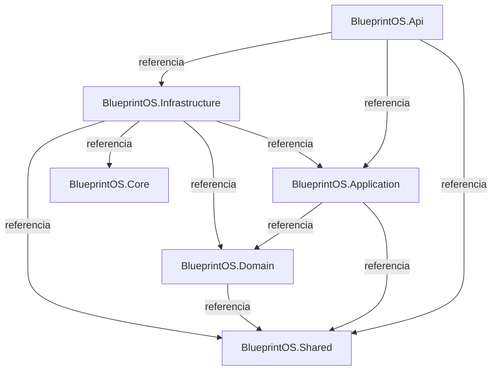

# BlueprintOS

## Executive Blueprint

| Campo | Informação |
|---|---|
| Versão | 1.0.0 |
| Data | 30 de julho de 2026 |
| Status do projeto | Em evolução — Fase 0: Fundação |
| Público-alvo | Diretoria |
| Classificação | Institucional |

> Documento executivo consolidado do BlueprintOS. Foco em negócio: problema, visão, capacidades, benefícios e roadmap. Detalhes de implementação técnica estão no Engineering Handbook.

## Sumário

1. [Executive Summary](#1-executive-summary)
2. [Problema de negócio](#2-problema-de-negócio)
3. [Visão da Plataforma](#3-visão-da-plataforma)
4. [Capacidades do BlueprintOS](#4-capacidades-do-blueprintos)
5. [Benefícios esperados](#5-benefícios-esperados)
6. [Roadmap Executivo](#6-roadmap-executivo)
7. [Estado atual](#7-estado-atual)
8. [Próximos passos](#8-próximos-passos)
9. [Visão de Arquitetura](#9-visão-de-arquitetura)

---

## 1. Executive Summary

O SOMA BlueprintOS é uma plataforma corporativa que automatiza processos de negócio por meio de agentes de inteligência artificial, com foco inicial em documentação viva e negociação de compras. O projeto está na Fase 0 (Fundação), com bases de arquitetura, padrões e documentação já entregues.

- **Sprints concluídas:** 4 (A7, A8, A9, A10).
- **Última sprint concluída:** Sprint A10 — Project State Consolidation.
- **Build/testes:** passando, 231 testes automatizados (230 unitários e 1 de integração; 0 ignorados e 0 falhos).

---

## 2. Problema de negócio

O problema de negócio específico e sua quantificação (custo atual, tempo perdido, risco) ainda não estão formalmente documentados. Esta seção será detalhada conforme evolução do produto.

---

## 3. Visão da Plataforma

O BlueprintOS é planejado para ser modular, escalável, seguro e multiempresa, automatizando processos de negócio por meio de agentes de IA especializados — com governança e rastreabilidade de decisões como pilares de operação.

O produto está em estágio inicial: a aplicação executável hoje é o backend de automação; a camada de usuário final (frontend) ainda está planejada.

---

## 4. Capacidades do BlueprintOS

Capacidades já implementadas na plataforma:

- **Documentação viva:** geração automática de documentação executiva, de cliente e de engenharia, com versionamento e histórico de mudanças.
- **Conhecimento organizacional:** ingestão e consulta baseada em conteúdo Markdown.
- **Agentes de IA:** runtime básico com `EchoAgent` e `KnowledgeAgent` sobre um runtime comum de IA.
- **Negociação de compras:** memória de negociação em processo e estratégia baseada em regras (urgência, histórico de fornecedor e faixa de preço), ainda sem agente Buyer sênior concreto.

Capacidades além destas ainda não foram implementadas; ver Roadmap Executivo.

---

## 5. Benefícios esperados

- **Fundação (Fase 0)** — base sólida de arquitetura e processo antes de investir em funcionalidade de negócio, reduzindo retrabalho futuro.
- **Módulos Core (Fase 1)** — identidade, planejamento e automação de processo como alicerce para os demais módulos.
- **Conhecimento e Memória (Fase 2)** — capacidade da plataforma de reter e recuperar conhecimento organizacional e operar agentes de IA.
- **Automação e Integrações (Fase 3)** — conexão com processos de negócio reais e sistemas externos da empresa.
- **Observabilidade e Escala (Fase 4)** — plataforma pronta para operação em produção, multiempresa e em escala.

---

## 6. Roadmap Executivo

O BlueprintOS está atualmente na **Fase 0 — Fundação**, em andamento.

| Fase | Objetivo de negócio | Status |
|---|---|---|
| 0 — Fundação | Estabelecer bases de arquitetura, padrões e processo | Em andamento |
| 1 — Módulos Core | Entregar identidade, planejamento e automação de processo | Planejado |
| 2 — Conhecimento e Memória | Plataforma capaz de reter conhecimento e operar agentes de IA | Parcial: Knowledge Markdown, memória de negociação e agentes básicos |
| 3 — Automação e Integrações | Conectar a plataforma a processos e sistemas externos | Planejado |
| 4 — Observabilidade e Escala | Operação em produção, multiempresa e em escala | Planejado |

---

## 7. Estado atual

| Indicador | Estado |
|---|---|
| Fase do projeto | Fase 0 — Fundação (em andamento) |
| Sprints concluídas | 4 (A7, A8, A9, A10) |
| Última entrega | Sprint A10 — Project State Consolidation |
| KPIs de negócio | Ainda não existem; produto não está em operação/produção |
| Dívidas técnicas em aberto | 16 (acompanhadas pela equipe de engenharia) |

---

## 8. Próximos passos

1. Documentar o problema de negócio e sua quantificação.
2. Aprovar ou ajustar a proposta da próxima sprint: uma API mínima de negociação para o +COMPRAS.
3. Definir autenticação, persistência e fronteira de API antes de expor dados corporativos.
4. Evoluir conhecimento e memória organizacional para uso ampliado por agentes de IA.
5. Iniciar o planejamento do frontend para usuários finais.

---

## 9. Visão de Arquitetura

```mermaid
graph TD
    Api[BlueprintOS.Api]
    Application[BlueprintOS.Application]
    Domain[BlueprintOS.Domain]
    Infrastructure[BlueprintOS.Infrastructure]
    Core[BlueprintOS.Core]
    Shared[BlueprintOS.Shared]
    Api -->|referencia| Application
    Api -->|referencia| Infrastructure
    Api -->|referencia| Shared
    Application -->|referencia| Domain
    Application -->|referencia| Shared
    Domain -->|referencia| Shared
    Infrastructure -->|referencia| Application
    Infrastructure -->|referencia| Core
    Infrastructure -->|referencia| Domain
    Infrastructure -->|referencia| Shared
```
